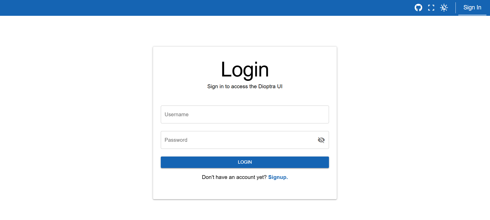
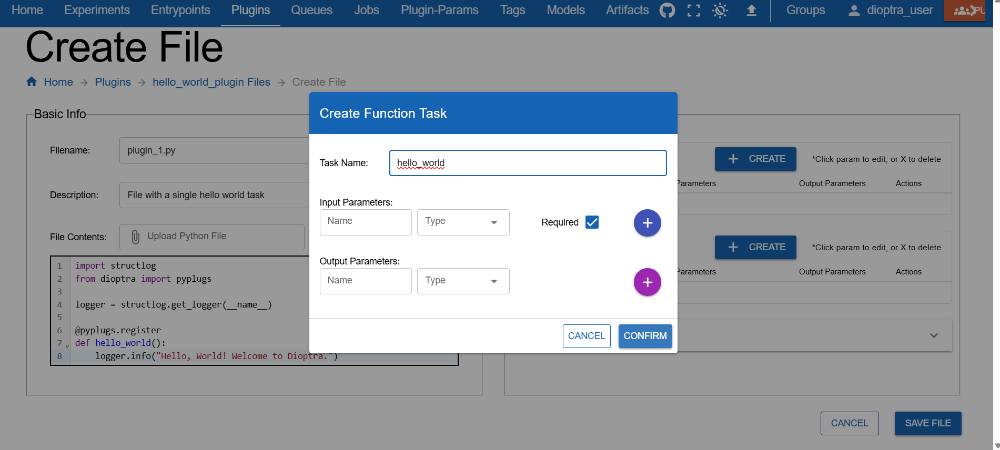

.. This Software (Dioptra) is being made available as a public service by the
.. National Institute of Standards and Technology (NIST), an Agency of the United
.. States Department of Commerce. This software was developed in part by employees of
.. NIST and in part by NIST contractors. Copyright in portions of this software that
.. were developed by NIST contractors has been licensed or assigned to NIST. Pursuant
.. to Title 17 United States Code Section 105, works of NIST employees are not
.. subject to copyright protection in the United States. However, NIST may hold
.. international copyright in software created by its employees and domestic
.. copyright (or licensing rights) in portions of software that were assigned or
.. licensed to NIST. To the extent that NIST holds copyright in this software, it is
.. being made available under the Creative Commons Attribution 4.0 International
.. license (CC BY 4.0). The disclaimers of the CC BY 4.0 license apply to all parts
.. of the software developed or licensed by NIST.
..
.. ACCESS THE FULL CC BY 4.0 LICENSE HERE:
.. https://creativecommons.org/licenses/by/4.0/legalcode

.. _reference-guidelines-for-documentation:

Guidelines for Documentation
============================

This is a guide for Dioptra developers that details **style and content guidelines** for Sphinx documentation pages.  

Dioptra documentation uses **reStructuredText (.rst)** with Sphinx. The documentation pages are located in ``/docs/source/`` 
and are built using the command ``uvx tox run -e web-compile,docs``.

Exemplar Documentation Pages
-----------------

The following pages serve as reference implementation for future documentation pages:

* :ref:`Plugins: reference <reference-plugins>`
* :ref:`how-to-create-plugins`
* :ref:`Plugins: explanation <explanation-plugins>`
* :ref:`Tutorial: Hello World in Dioptra <tutorial-hello-world-in-dioptra>` and :ref:`Tutorial: Learning the Essentials <tutorial-learning-the-essentials>`

Documentation goals
-------------------

- **Brevity & placement.** Put content where it belongs; avoid duplication across types.
- **Single purpose per page.** Don’t mix a tutorial with reference or explanation on the same page.
- **Source of truth lives in code dirs.** Bring example code in with ``literalinclude``.
- **Cross Reference Documentation.** Don't repeat information across pages - reference relevant complimentary materials using sphinx cross references instead. 

Documentation File Placement
--------------------------------------

This is the current proposed structure for storing documentation static assets. 

Image Files
~~~~~~~~~~~~~

All images should be stored in ``docs/source/images/``. Avoid storing images inside the specific documentation folders (e.g., avoid ``docs/source/tutorials/images``).

**Directory Structure**

* **GUI Screenshots:** Store screenshots in ``docs/source/images/GUI_screenshots/``.
    * Organize these sub-folders roughly by the **Vue/Quasar page** they represent (e.g., `jobs`, `plugins`, `experiments`).
    * This structure allows screenshots to potentially be reused across different content types (e.g., using the same "Login" screenshot in both a *Tutorial* and a *How-to*).
    * It also makes identifying screenshots that require updates easier once a Quasar page changes.
* **Figures:** Store conceptual diagrams, architecture flows, and non-GUI visuals in ``docs/source/images/figures/``.

.. code-block:: text

   docs/source/images/
   ├── GUI_screenshots/
   │   ├── entrypoints/
   │   ├── experiments/
   │   ├── jobs/
   │   ├── login/
   │   ├── plugins/
   │   └── ...
   └── figures/
       ├── entrypoint_diagram.png
       ├── experiment_overview.png
       └── ...

Documentation Code Snippets
~~~~~~~~~~~~~~~~~~~~~~~~~~~~~~~~~~~~~~~

Code will ideally never be written inline on .rst pages. Whenever appropriate, the documentation should reference the doc strings for methods and classes.
When bespoke code snippets are needed (i.e. for tutorial workflows, etc), place the code in the docs directory and use ``.. literalinclude::`` to pull it in.

**Directory Structure**

Documentation code that is not meant to be run in production or in a standalone manner lives in ``docs/source/documentation_code/``.

Within this directory: 

* **Client Workflows:** Python scripts demonstrating the Python Client API (e.g., connecting, authenticating, submitting jobs).
* **Plugins:** Python files with plugin tasks and artifact tasks. 
* **Artifact Task Graphs:** YAML files with artifact task graphs 
* **Task Graphs:** YAML files with entrypoint task graphs

**Current Directory Structure**:

.. code-block:: text

   docs/source/documentation_code/
   ├── client_workflows/
   │   ├── import_plugins.py   
   │   └── client_setup.py     
   ├── artifact_task_graphs/
   ├── task_graphs/ 
   └── plugins/ 
       ├── essential_workflows_tutorial
       └── hello_world_tutorial

Diátaxis content types
----------------------

Content is organized according to the `Diátaxis <https://diataxis.fr/>`_ framework:

- **Tutorials**
- **How-to guides**
- **Reference**
- **Explanation**

The following principles apply the Diátaxis framework to Dioptra documentation:

Tutorials (learning by doing)
~~~~~~~~~~~~~~~~~~~~~~~~~~~~~

- Learn by doing
- Provide early wins for users with small accomplishments
- Tell readers upfront what to expect ("In this tutorial, you will build a plugin that...")
- Give feedback along the way ("You should see...")
- Minimize explanation — link out to other docs instead

How-to guides (solve a task)
~~~~~~~~~~~~~~~~~~~~~~~~~~~~

- Cookbook style - a recipe / procedural workflow to accomplish a specific goal
- One outcome per page
- Concise, no digressions

Reference (facts)
~~~~~~~~~~~~~~~~~

- Precise, factual
- No steps or advice
- Covers APIs, schemas, configs, syntax, requirements, etc

Explanation (concepts & why)
~~~~~~~~~~~~~~~~~~~~~~~~~~~~

- Provide background and rationale
- Cover trade-offs and mental models
- No steps
- "Read once" and then never read again (ideally)

Each documentation page should align with one of these types.

**The Table of Contents headers reflect these types:**

* "**What is Dioptra**" →  Explanation 
* "**Set Up**" →  How To
* "**Explainers**" →  Explanation 
* "**Tutorials**" →  Tutorials 
* "**How Tos**" →  How To 
* "**Reference**" →  Reference 

Style guide for RST documents
-----------------------------

The following collection details styling components—custom-defined or provided by Sphinx—used in Dioptra documentation.

.. note:: **Custom CSS**

   Custom CSS classes are defined in files in ``docs/assets/scss/`` and imported into ``dioptra.scss``. These scss files are compiled 
   when the docs are built with ``uvx tox run -e web-compile,docs`` and create the resulting ``docs/source/_static/dioptra.css`` file. 

.. note:: **Custom JavaScript**
   
   Custom javascript code exists in ``docs/source/_static/``.
   These assets are loaded via ``docs/conf.py`` using ``html_css_files`` and ``html_js_files`` to point to CSS and JS code in the ``_static`` directory. 
  
Section hierarchy
~~~~~~~~~~~~~~~~

Headings should be nested consistently.

- ``=`` for page title
- ``-`` for H2
- ``~`` for H3
- ``^`` for H4

Put these symbols under text to create a heading. The heading is automatically included in the 
right side table of contents. 

**Header Example:** 

.. code-block:: rst

   .. _doc-type-doc-title-my-example-header:

   My Example Header 
   -------------------

   Section contents...

   .. _doc-type-doc-title-my-example-subheader:

   My Example Subheader 
   ~~~~~~~~~~~~~~~~~~~~

   Section contents .. (nested under "My Example Header" in ToC)

.. seealso:: 

   See :ref:`cross-references <reference-guidelines-for-documentation-cross-references>` section below to understand cross reference labels used in this example. 

Steps (Linkable Headers on a Card)
~~~~~~~~~~~~~~~~~~~~

When documenting steps for a tutorial or how-to guide, make the step name a header and use two CSS classes to place 
the steps onto a card. This makes them linkable and easy to visually distinguish. 

Custom CSS classes: 

* ``header-on-a-card`` - puts the entire section on a card with slight padding and box shadow 
* ``header-steps`` - Adds the blue clipboard to the header and the bottom border, and adjusts the header font size

Example Steps (Rendered)
^^^^^^^^^^^^^^^^^^^^^^^^^^^^^^^^^^^^^^^^^^^^^

.. rst-class:: header-on-a-card header-steps

Example Step 1: Create the Plugin Container
^^^^^^^^^^^^^^^^^^^^^^^^^^^^^^^^^^^^^^^^^^^^^

1. Open **Plugins**.
2. Click **Create Plugin**.
3. Name it and **Save**.

   .. note:: Make sure you click save. 

.. rst-class:: header-on-a-card header-steps

Example Step 2: Add a file
^^^^^^^^^^^^^^^^^^^^^^^^^^^^^^^^^^^^^^^^^^^^^

1. Click on the Plugin
2. Click **Add a File**
3. Click **Register Task** and create these inputs:

      * ``sample_size`` : int 
      * ``mean`` : float

4. Click **Save** 

.. admonition:: Learn More

   * :ref:`plugins-explanation` - Learn about plugins

RST Source (for above example)
^^^^^^^^^^^^^^^^^^^^^^^^^^^^^^^^^^^^^^^^^^^^^

.. code-block:: rst

   .. rst-class:: header-on-a-card header-steps

   Example Step 1: Create the Plugin Container
   ^^^^^^^^^^^^^^^^^^^^^^^^^^^^^^^^^^^^^^^^^^^^^

   1. Open **Plugins**.
   2. Click **Create Plugin**.
   3. Name it and **Save**.

      .. note:: Make sure you click save. 

   .. rst-class:: header-on-a-card header-steps

   Example Step 2: Add a file
   ^^^^^^^^^^^^^^^^^^^^^^^^^^^^^^^^^^^^^^^^^^^^^

   1. Click on the Plugin
   2. Click **Add a File**
   3. Click **Register Task** and create these inputs:

         * ``sample_size`` : int 
         * ``mean`` : float

   4. Click **Save** 
      
   .. admonition:: Learn More

      * :ref:`plugins-explanation` - Learn about plugins

**Note the following:**

- Use of **bold** to emphasize the concrete actions within a step (corresponds to buttons, etc)
- The creation of separating lines between **header-steps** classes is automatically done through a CSS rule 
- You can nest other classes / structures within the **header-steps** & **header-on-a-card** class, but use sparingly. 
   Items commonly nested on cards include:

   - ``.. admonition:: Learn More`` - Custom "learn more" override of the admonition box 
   - ``.. note::`` - Built in sphinx blue sphinx box that says "Note" 
   - Indentation to create a block quote 

.. warning:: 
   Once you use a custom **header-on-a-card** class, the card container will continue until the next header. 
   This is how  ``.. rst-class:: header-on-a-card header-steps`` works - the styling wraps the entire next 
   header in a styled div that continues until the next header. 

"See Also" (Linkable Headers on a Card)
~~~~~~~~~~~~~~~~

To create a prominent section of additional reading material, use the custom RST classes
``header-on-a-card`` combined with ``header-seealso``. This will create 
a lightly indented card with a green header that also has an anchor link and appears in the HTML 
sidebar. 

Example of See Also Card Header (Rendered)
^^^^^^^^^^^^^^^^^^^^^^^^^^^^^^^^^^^^^^^^^^^

.. rst-class:: header-on-a-card header-seealso

See Also 
^^^^^^^^^^^^^^^^^^^^^^^^^^^^^^^^^^^^^^^^^^^
This is a hands-on tutorial intended to walk a user through the procedural steps required to 
use Dioptra. The following resources are complimentary and provide high level explanations on Dioptra's 
design and motivation. 

* :ref:`Overview of Experiments <experiment-overview-explanation>` - A summary of how Dioptra components interact to create an experiment
* :ref:`Why Dioptra? <why-dioptra-explanation>` - An explanation of what Dioptra was built for

RST Source
^^^^^^^^^^^^^^^^^^^^^^^^^^^^^^^^^^^^^^^^^^^

.. code-block:: rst

   .. rst-class:: header-on-a-card header-seealso

   See Also 
   ^^^^^^^^^^^^^^^^^^^^^^^^^^^^^^^^^^^^^^^^^^^
   This is a hands-on tutorial intended to walk a user through the procedural steps required to 
   use Dioptra. The following resources are complimentary and provide high level explanations on Dioptra's 
   design and motivation. 

   * :ref:`Overview of Experiments <experiment-overview-explanation>` - A summary of how Dioptra components interact to create an experiment
   * :ref:`Why Dioptra? <why-dioptra-explanation>` - An explanation of what Dioptra was built for

Notes, warnings, important, and "see also"
~~~~~~~~~~~~~~~~~~

To caveat steps or reference explanation/reference material elsewhere, use notes, warnings, and the important flag. 
These divs are built in to sphinx. While visually distinct, they utilize significant padding to indicate optional content.
Use them sparingly for information that is not required reading. 

.. tabs::

   .. tab:: Rendered

      .. note::
         This tutorial uses the **web UI**; you can do the same via **API** or **TOML**.

      .. warning::
         Make sure the queue is **Public** or jobs won’t start.

      .. important::
         In YAML, null is interpreted as the null value. Therefore, it does not name the null type!

      .. seealso::
         View the :ref:`plugins-explanation` for more information.

   .. tab:: RST Source

      .. code-block:: rst

         .. note::
            This tutorial uses the **web UI**; you can do the same via **API** or **TOML**.

         .. warning::
            Make sure the queue is **Public** or jobs won’t start.

         .. important::
            In YAML, null is interpreted as the null value. Therefore, it does not name the null type!

         .. seealso::
            View the :ref:`plugins-explanation` for more information. 

Nesting these elements in other cards or containers can result in visual clutter.
Overusing these elements can result in visual clutter as well. These elements 
don't provide anchor links, so don't use them for major sections as they won't be embedded in the table of contents. 

Placing items in the margin 
~~~~~~~~~~~~~~~~~~~~~~~~~~~~

Important, note, warning and "see also" boxes can be placed in the margin with the following syntax.

.. margin::

   .. important::

      The NGINX SSL/TLS disabled and enabled tabs are just snippets.
      The snippets omit the lines that come both before and after the ``healthcheck:`` and ``ports:`` sections.
      **Do not delete these surrounding lines in your actual file!**

**RST source code**

.. code-block:: rst

   .. margin::

      .. important::

         The NGINX SSL/TLS disabled and enabled tabs are just snippets.
         The snippets omit the lines that come both before and after the ``healthcheck:`` and ``ports:`` sections.
         **Do not delete these surrounding lines in your actual file!**

The Sphinx table of contents sidebar automatically collapses when it would be interfering with a box 
in the margins. On narrow screens, these elements are hidden and require horizontal scrolling. 

"Learn More" - Minimalistic div for more information
~~~~~~~~~~~~~~~~~~~~~~~~~~~~~~~~~~~~~~~~~~~~~~~~~~~

Custom CSS rules were created to define a minimalistic presentation for extra information.
This class overrides the admonition box when the title "Learn More" is added. 
The use of this class is preferred to the ``.. seealso::`` built in sphinx element when used inside 
another element. 

.. tabs::

   .. tab:: Rendered

      .. admonition:: Learn More

         View the :ref:`plugins-explanation` for more information. 

   .. tab:: RST Source

      .. code-block:: rst

         .. admonition:: Learn More

            View the :ref:`plugins-explanation` for more information. 

This is similar to the ``.. seealso::`` built in sphinx box, but it has more minimal padding and is more appropriate 
to use nested inside other elements. 

Figures (screenshots)
~~~~~~~~~~~~~~~~~~~~~

Screenshots should be cropped and zoomed for readability. Always include ``:alt:`` text.  

**Custom CSS and JavaScript** are available for images.

To apply this styling, use one or more of the following figure classes with ``:figclass:``:

- ``border-image`` → Adds a light border, shadow, and background  
- ``clickable-image`` → Makes the image interactive with cursor + modal support  
- ``big-image`` → Allows images to grow wider than the text column (experimental; CSS overrides may conflict with sidebar/layout changes — use sparingly)

.. note::
   Modals are included by through the addition of a ``div`` element in the ``layout.html`` footer.

**Screenshots that use combinations of these three CSS classes**

*On click, JavaScript shows the modal* ``div`` *element. *

**Using** ``border-image`` **and** ``clickable-image``:

   Using the custom image class - clicking the image opens a modal.

**Using** ``big-image``, ``border-image`` **and** ``clickable-image``:

   Using the ``big-image`` figclass - not recommended because it interferes 
   with the HTML sidebar.

**RST Source code**

.. code-block:: rst
      
   **Using** ``border-image`` **and** ``clickable-image``:

   .. figure:: ../tutorials/hello_world/_static/screenshots/login_dioptra.png
      :alt: Dioptra login screen
      :figclass: border-image clickable-image 

      Using the custom image class - clicking the image opens a modal.

   **Using** ``big-image``, ``border-image`` **and** ``clickable-image``:

   .. figure:: ../tutorials/hello_world/_static/screenshots/register_hello_world_task.png
      :alt: Dioptra login screen
      :figclass: border-image clickable-image big-image

      Using the ``big-image`` figclass - not recommended because it interferes 
      with the HTML sidebar.

.. warning::
   Making images larger than the text column with ``big-image`` is potentially **fragile** and relies on CSS workarounds.
   It may look odd with different sidebar widths or screen sizes. Prefer standard-sized images unless
   the extra width is necessary for readability.

Literal includes
~~~~~~~~~~~~~~~~

Use ``literalinclude`` to pull code from the repo instead of pasting it:

.. tabs::

   .. tab:: Rendered

      **hello_world.py**:

      .. literalinclude:: ../../../docs/source/documentation_code/plugins/hello_world_tutorial/hello_world.py 
         :language: python
         :linenos:

   
   .. tab:: RST Source

      .. code-block:: rst

         **hello_world.py**:

         .. literalinclude:: ../../../docs/source/documentation_code/plugins/hello_world_tutorial/hello_world.py
            :language: python
            :linenos:

Custom Code Block Styling
~~~~~~~~~~~~~~~~

Custom CSS classes are available to style code blocks for improved visual separation and language-specific branding. 
Font size is also reduced to save space for long code blocks. 
Apply these classes using the standard Sphinx admonition directive.

**Available Classes**

Use the following classes with an ``.. admonition::`` block:

- ``code-panel``: The base class. This applies the custom box, rounded corners, shadow, and reduced font size.
- ``python``: Applies the custom dark blue title bar, yellow border, and the >>> prompt prefix.
- ``yaml``: Applies the custom dark brown title bar, dark border, and the >> prompt prefix.
- ``console``: Applies custom dark theme and the $ prompt prefix.

.. tabs::

   .. tab:: Rendered

      .. admonition:: <My Python LiteralInclude>
         :class: code-panel python
      
         .. literalinclude:: ../../../docs/source/documentation_code/plugins/essential_workflows_tutorial/sample_normal.py
            :language: python
            :linenos:

      .. admonition:: <My YAML LiteralInclude>
         :class: code-panel yaml

         .. literalinclude:: ../../../docs/source/documentation_code/task_graphs/essential_workflows_tutorial/sample_and_transform.yaml 
            :language: yaml

      .. admonition:: <My Console Input/Output>
         :class: code-panel console

         .. code-block:: console

            Plugin 1 was successfully completed. Output value was .7432 with parameter "random".

   
   .. tab:: RST Source

      .. code-block:: rst

         .. admonition:: <My Python LiteralInclude>
            :class: code-panel python

            .. literalinclude:: ../../../docs/source/documentation_code/plugins/essential_workflows_tutorial/sample_normal.py
               :language: python
               :linenos:

         .. admonition:: <My YAML LiteralInclude>
            :class: code-panel yaml

            .. literalinclude:: ../../../docs/source/documentation_code/task_graphs/essential_workflows_tutorial/sample_and_transform.yaml 
               :language: yaml

         .. admonition:: <My Console Input/Output>
            :class: code-panel console

            .. code-block:: console
               
               Plugin 1 was successfully completed. Output value was .7432 with parameter "random".
               
.. note::
   Use unique comments, such as ``# [docs:start]`` and ``# [docs:end]``, in Python files
   (or the appropriate comment style for other languages)
   to only grab sections of code. These tags must be present in the code files.

   In ``literalincludes``, use the following syntax:

   .. code-block:: rst

      .. literalinclude:: python_file.py
         :language: python
         :start-after: # my-start-comment
         :end-before: # my-end-comment

Tabs for alternate paths
~~~~~~~~~~~~~~~~~~~~~~~~

Tabs can be used for alternate instructions (e.g., GUI vs. Python client), as demonstrated below.

.. tabs::

   .. tab:: Rendered

      .. tabs::

         .. group-tab:: GUI
            Login using the GUI

            .. figure:: ../tutorials/hello_world/_static/screenshots/login_dioptra.png
               :alt: Dioptra login screen
               :width: 900px
               :figclass: border-image

         .. group-tab:: Python Client
            Login using the Python client API 

            .. code-block:: python

               LOCAL_PATH = 'http://127.0.0.1'
               from dioptra.client import connect_json_dioptra_client
               client = connect_json_dioptra_client(LOCAL_PATH)
               client.users.create(username=USER_NAME, email=USER_EMAIL, password=USER_PASSWORD)
               client.auth.login(USER_NAME, USER_PASSWORD)

      .. tabs::

         .. group-tab:: GUI
            Create a plugin in the GUI

            .. figure:: ../tutorials/hello_world/_static/screenshots/register_hello_world_task.png
               :alt: Dioptra login screen
               :width: 900px
               :figclass: border-image

         .. group-tab:: Python Client
            Create a plugin using the Python client. 

            .. code-block:: python

               plugin = client.plugins.create(group_id,
                                "hello",
                                "This is a Hello World Plugin")

   .. tab:: RST Source

      .. code-block:: rst

         .. tabs::

            .. group-tab:: GUI
               Login using the GUI

               .. figure:: ../tutorials/hello_world/_static/screenshots/login_dioptra.png
                  :alt: Dioptra login screen
                  :width: 900px
                  :figclass: border-image

            .. group-tab:: Python Client
               Login using the Python client API 

               .. code-block:: python

                  LOCAL_PATH = 'http://127.0.0.1'
                  from dioptra.client import connect_json_dioptra_client
                  client = connect_json_dioptra_client(LOCAL_PATH)
                  client.users.create(username=USER_NAME, email=USER_EMAIL, password=USER_PASSWORD)
                  client.auth.login(USER_NAME, USER_PASSWORD)

         .. tabs::

            .. group-tab:: GUI
               Create a plugin in the GUI

               .. figure:: ../tutorials/hello_world/_static/screenshots/register_hello_world_task.png
                  :alt: Dioptra login screen
                  :width: 900px
                  :figclass: border-image

            .. group-tab:: Python Client
               Create a plugin using the Python client. 

               .. code-block:: python

                  plugin = client.plugins.create(group_id,
                                 "hello",
                                 "This is a Hello World Plugin")

.. note::

   To have tabs synchronize together (like above example), use the ``.. group-tab::`` syntax 
   and make sure the tabs are named the exact same thing across iterations, i.e. ``.. group-tab:: Python Client`` 
   wil be synchronized with another instanced of ``.. group-tab:: Python Client``. If synchronization is not required, replace
   ``group-tab`` with ``tab``. 

.. _reference-guidelines-for-documentation-cross-references: 

Cross-references
~~~~~~~~~~~~~~~~

Use explicit references (``.. _label-name:``) together with ``:ref:``.  
This is the most reliable way to link between pages, since it does not  
depend on the document being in a ``.. toctree::``. Note that displayed link text is equal to the page 
title but can be overridden using the ``<>`` syntax (see example).

.. tabs::

   .. tab:: Rendered

      See more about :ref:`getting-started-running-dioptra`  
      in the dedicated page.

      See more about :ref:`My custom reference name for the same page <getting-started-running-dioptra>`
      in the dedicated page. 

   .. tab:: RST Source

      .. code-block:: rst

         See more about :ref:`getting-started-running-dioptra`  
         in the dedicated page.

         See more about :ref:`My custom reference name for the same page <getting-started-running-dioptra>`
         in the dedicated page. 
         
.. note::

   To make a ``:ref:`` work, the target document must define a label
   (``.. _label-name:``) in the .rst file. Without a label, ``:link-type: ref`` cannot resolve.

   Place the label near the top of the file you want to link to. For example:

   .. code-block:: rst

      .. _tutorial-1:

      Tutorial 1
      ==========

      Continue with the rest of the document...

      .. _tutorial-1-header-2:

      Tutorial 1 Header 2:
      ----------------------

      Continue with the rest of the document...

   With those two labels in the .rst file, you could link to the page / specific section with:

   .. code-block:: rst

      :ref:`tutorial-1` 
      :ref:`tutorial-1-header-2`

   Notice that the leading underscore is omitted when using a ``:ref:``. 

.. important::

   To standardize the label names for .rst references, use this formula:

   ``_{page_type}-{page_title}-{optionally: header_title}``

   i.e.

   ``_{tutorial}-{running-hello-world}-{step-2-create-a-plugin}``

   Examples: 

      * ``_how-to-create-plugins`` 
      * ``_tutorial-adding-inputs-and-outputs``
      * ``_reference-plugins``
      * ``_reference-plugins-plugin-function-tasks`` → includes header_title

   Notice that we only use dashes, no underscores. Use the page type in the singular, e.g. ``explanation``, ``reference``, 
   ``how-to``, ``tutorial``. 

Additional Sphinx Elements
---------------------------------------

The following elements are currently unused but available for documentation.

Collapsible content
~~~~~~~~~~~~~~~~

Collapsible admonitions could be used for long sections of code or optional context. 

.. tabs::

   .. tab:: Rendered

      .. admonition:: Python Plugin Code (long)
         :class: dropdown code-panel python

         .. literalinclude:: ../../../docs/source/documentation_code/plugins/essential_workflows_tutorial/sample_normal.py
            :language: python
            :linenos:

   .. tab:: RST Source

      .. code-block:: rst

         .. admonition:: Python Plugin Code (long)
            :class: dropdown code-panel python

            .. literalinclude:: ../../../docs/source/documentation_code/plugins/essential_workflows_tutorial/sample_normal.py
               :language: python
               :linenos:

Sphinx Page Options
~~~~~~~~~~~~~~~~

1. **Remove the page specific table of contents** on the right-hand side:

   - Place ``:html_theme.sidebar_secondary.remove:`` in the .rst file, ideally at the top.

Cards, grids, and callouts
~~~~~~~~~~~~~~~~

`sphinx-design` provides cards and grids for menus or callouts.  

.. tabs::

   .. tab:: Rendered

      .. grid:: 2

         .. grid-item-card:: **Run Dioptra**
            :link: getting-started-running-dioptra
            :link-type: ref

            Step-by-step instructions for running Dioptra.

         .. grid-item-card:: **Installation**
            :link: getting-started-installation
            :link-type: ref

            How to install Dioptra locally.

         .. grid-item-card:: **Build Containers**
            :link: getting-started-building-the-containers
            :link-type: ref

            Instructions for building container images.

         .. grid-item-card:: **Additional Configuration**
            :link: getting-started-additional-configuration
            :link-type: ref

            Optional configuration steps after setup.

   .. tab:: RST Source

      .. code-block:: rst

         .. grid:: 2

            .. grid-item-card:: **Run Dioptra**
               :link: getting-started-running-dioptra
               :link-type: ref

               Step-by-step instructions for running Dioptra.

            .. grid-item-card:: **Installation**
               :link: getting-started-installation
               :link-type: ref

               How to install Dioptra locally.

            .. grid-item-card:: **Build Containers**
               :link: getting-started-building-the-containers
               :link-type: ref

               Instructions for building container images.

            .. grid-item-card:: **Additional Configuration**
               :link: getting-started-additional-configuration
               :link-type: ref

               Optional configuration steps after setup.

