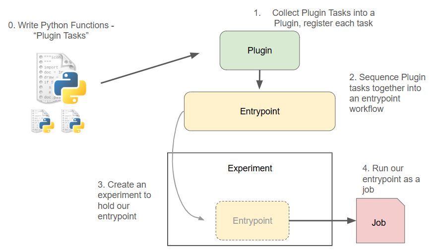

.. This Software (Dioptra) is being made available as a public service by the
.. National Institute of Standards and Technology (NIST), an Agency of the United
.. States Department of Commerce. This software was developed in part by employees of
.. NIST and in part by NIST contractors. Copyright in portions of this software that
.. were developed by NIST contractors has been licensed or assigned to NIST. Pursuant
.. to Title 17 United States Code Section 105, works of NIST employees are not
.. subject to copyright protection in the United States. However, NIST may hold
.. international copyright in software created by its employees and domestic
.. copyright (or licensing rights) in portions of software that were assigned or
.. licensed to NIST. To the extent that NIST holds copyright in this software, it is
.. being made available under the Creative Commons Attribution 4.0 International
.. license (CC BY 4.0). The disclaimers of the CC BY 4.0 license apply to all parts
.. of the software developed or licensed by NIST.
..
.. ACCESS THE FULL CC BY 4.0 LICENSE HERE:
.. https://creativecommons.org/licenses/by/4.0/legalcode

.. _explanation-workflow-architecture:

Workflow Architecture
================

An overview of how all the high level Dioptra components orchestrate together to execute jobs.

Summary: What comprises a Dioptra Workflow?
--------------------------

To run a :ref:`job <explanation-experiments-and-jobs>` within a Dioptra :ref:`experiment <explanation-experiments-and-jobs>`, multiple Dioptra components need to be
created and work together. This explainer provides a high level view of how all these pieces fit together.

   **Dioptra Workflow Overview**
   The four essential steps needed to run Python functions in Dioptra.

As the above diagram illustrates, modular functions and execution graphs are the bedrock of running jobs in Dioptra.

More specifically:

* :ref:`Tasks <explanation-plugins>` are parameterizable functions that are stored within :ref:`Plugin containers <explanation-plugins>`
* :ref:`Entrypoints <explanation-entrypoints>` are reusable, parameterizable execution graphs that chain together multiple Tasks, defined via the a :ref:`Task Graph <explanation-task-graph>`
* A :ref:`Job <explanation-experiments-and-jobs>` is a parameterized execution of an Entrypoint within an :ref:`Experiment <explanation-experiments-and-jobs>`.
* Jobs can produce :ref:`Artifacts <explanation-artifacts>`, which are objects saved to disk.

Example Experiment: Adversarial ML
~~~~~~~~~~~~~~~~~~~~~

In the context of a Dioptra experiment seeking to **evaluate ML attacks and defenses**, some potential examples include:

* **Function Tasks**:
   * **Task 1**: *Prepare a dataset for training*
   * **Task 2**: *Fit a model*
   * **Task 3**: *Evaluate a model*
   * **Task 4**: *Generate adversarial inference examples*
   * etc...

* **Artifact Tasks**:
   * **Task 1**: *Save/read a trained model to/from disk*
   * **Task 2**: *Save/read adversarial data to/from disk*
   * etc...

* **Entrypoints**:
   * **EP 1**: *Perform a model training workflow*

      Dataset preparation → Model fitting → Model saving

   * **EP 2**: *Adversarial dataset creation*

         Dataset loading → Adversarial attack optimization → Dataset generation → Dataset saving

   * etc...

* **Experiments**:
   * **EXP 1**: *Adversarial testing for vision models*
   * **EXP 2**: *Adversarial testing for audio models*
   * etc..

As the examples above illustrate, the key to Dioptra is defining appropriately sized resources that can be reused across a variety of contexts.
When jobs are run in the Dioptra environment, Dioptra handles all the data persistence, queue management, dependencies, type checking and more.
Dioptra's ability to parametrize function tasks, entrypoints and jobs in an organized matter unlocks the ability to execute
experiment permutations in a principled way.

.. admonition:: Learn More

   See these concepts in action by viewing tutorials / reference implementations:

   * :ref:`tutorial-hello-world-in-dioptra` - Running a simple function in Dioptra
   * :ref:`tutorial-learning-the-essentials` - Building up advanced functionality in Dioptra
   * :ref:`tutorial-optic-adversarial-ml` - A realistic reference implementation for adversarial ML on image data

What is required to run code in Dioptra?
---------------------

Dioptra is primarily a platform for executing custom code in an **organized and reproducible manner**. Currently, Dioptra supports the execution of Python code only.

Workflow for job execution
~~~~~~~~~~~~~~~~~~~~~~~~~~

To run code in Dioptra, you'll need to perform the following steps:

1. Define functions in Python
2. Register those functions in a :ref:`plugin <how-to-create-plugins>`
3. :ref:`Define an entrypoint <how-to-create-entrypoints>` workflow that uses those function tasks
4. Create an :ref:`experiment <how-to-create-experiments>` and attach your entrypoint
5. Run a :ref:`job <how-to-running-jobs>` within that experiment, determining parameters, artifact inputs, and artifact outputs.

Required infrastructure
~~~~~~~~~~~~~~~~~~~~~~~~~~

Additionally, you'll have to set up the following infrastructure before you can run a job:

1. A :ref:`worker <explanation-queues-and-workers>`, which executes jobs, needs to be running and connected to a :ref:`queue <explanation-queues-and-workers>`

   - **Note:** Dioptra automatically establishes two workers out of the box: ``tensorflow-cpu`` and ``pytorch-cpu``. These workers are built as standalone Docker containers. :ref:`GPU workers can also be built <how-to-build-container-images-gpu>` for users with GPU access, and :ref:`custom workers <how-to-using-custom-workers>` can be deployed as well

2. A :ref:`user profile and user group <how-to-create-users-and-groups>` need to be defined for permissions access to Dioptra resources

.. rst-class:: fancy-header header-seealso

See Also
---------

With this high level view of Dioptra workflows in mind, continue reading about the **individual components of Dioptra** for a deeper understanding.

* :ref:`Explanation: Dioptra Components<explanation-dioptra-components>`

The Dioptra **how-to guides** instruct users on how to build each of these components in the Graphical User Interface (GUI) and with the Python Client.

* :ref:`How to: Running Experiments <how-to-running-experiments>`

The Dioptra **component glossary** provides a useful reference for all the components mentioned here.

* :ref:`reference-dioptra-components-glossary`
