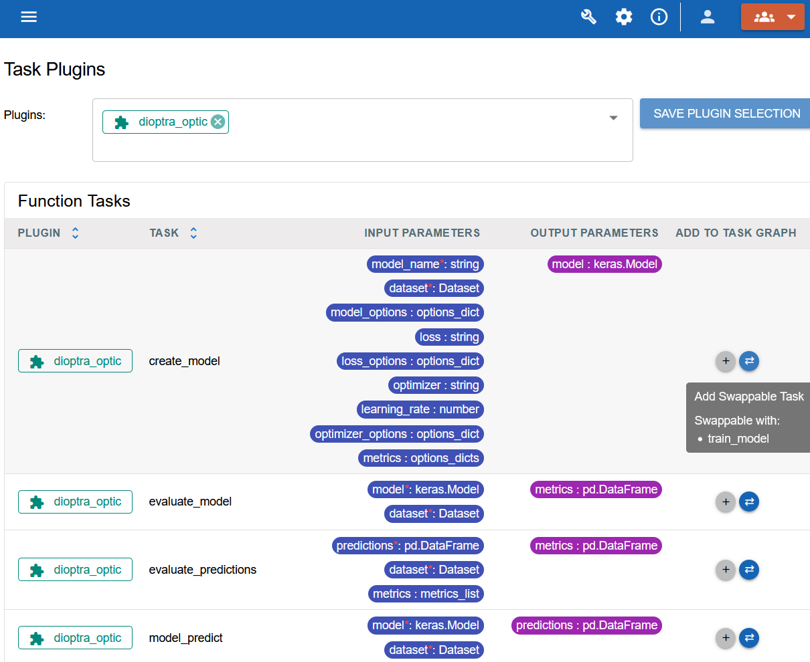
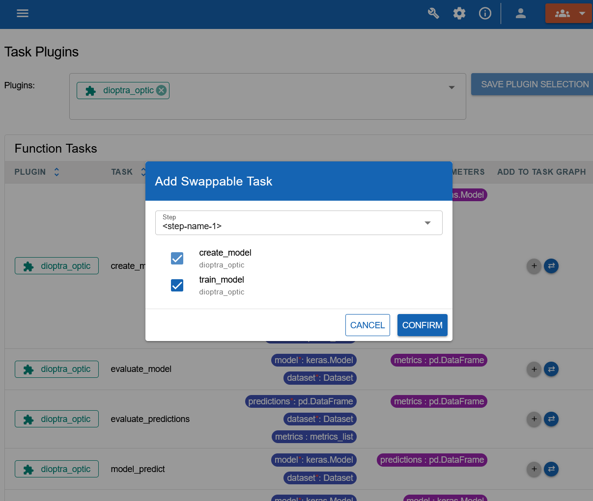

.. This Software (Dioptra) is being made available as a public service by the
.. National Institute of Standards and Technology (NIST), an Agency of the
.. United States Department of Commerce. This software was developed in part by
.. employees of NIST and in part by NIST contractors. Copyright in portions of
.. this software that were developed by NIST contractors has been licensed or
.. assigned to NIST. Pursuant to Title 17 United States Code Section 105, works
.. of NIST employees are not subject to copyright protection in the United
.. States. However, NIST may hold international copyright in software created
.. by its employees and domestic copyright (or licensing rights) in portions of
.. software that were assigned or licensed to NIST. To the extent that NIST
.. holds copyright in this software, it is being made available under the
.. Creative Commons Attribution 4.0 International license (CC BY 4.0). The
.. disclaimers of the CC BY 4.0 license apply to all parts of the software
.. developed or licensed by NIST.
..
.. ACCESS THE FULL CC BY 4.0 LICENSE HERE:
.. https://creativecommons.org/licenses/by/4.0/legalcode

.. _how-to-add-swappable-tasks:

Add Swappable Tasks to an Entrypoint Graph
==========================================

This how-to explains how to add swaps to an
:ref:`Entrypoint <explanation-entrypoints>` task graph in the Dioptra GUI. A
swap lets a job select one task from a set of compatible tasks while keeping
the rest of the workflow unchanged.

Prerequisites
-------------

* :ref:`how-to-prepare-deployment` - A deployment of Dioptra is required.
* :ref:`tutorial-setup-dioptra-in-the-gui` - Access Dioptra services in the GUI, create a user, and log in.
* :ref:`how-to-create-plugins` - Create and register the Function Tasks to use in the swap.
* :ref:`how-to-create-entrypoints` - Create an entrypoint and attach the plugins that contain those tasks.

The tasks in a swap must have the same number of output parameters and the
same output parameter types in the same order. Their input parameters may be
different.

Add a Swappable Task
--------------------

Follow these steps to create a new swap step or add an alternate task to an
existing swap step.

.. rst-class:: header-on-a-card header-steps

Step 1: Open the Entrypoint Task Graph editor
~~~~~~~~~~~~~~~~~~~~~~~~~~~~~~~~~~~~~~~~~~~~~

In the Dioptra GUI, open the entrypoint you want to edit. In the **Task Graph
Info** section, make sure the plugins containing the compatible Function Tasks
are selected. The tasks appear in the **Function Tasks** table.

.. rst-class:: header-on-a-card header-steps

Step 2: Select the compatible tasks
~~~~~~~~~~~~~~~~~~~~~~~~~~~~~~~~~~~

In the **Function Tasks** table, find a task that has one or more compatible
tasks. Click the **Add Swappable Task** button beside that task.

   Clicking the Add a swappable task button

In the **Add Swappable Task** dialog, select the tasks that should be available
at the same step. When creating a new swap, select at least two tasks. The
selected task is included automatically; select one or more additional
compatible tasks, then click **Confirm**.

   Selecting a task from the swappable task selection dialog

   

.. rst-class:: header-on-a-card header-steps

Step 3: Create a new swap step or extend an existing one
~~~~~~~~~~~~~~~~~~~~~~~~~~~~~~~~~~~~~~~~~~~~~~~~~~~~~~~~

Use the **Step** menu in the dialog to choose where to add the task:

* To create a new swap step, leave the default new step selected. Dioptra adds
  the selected tasks to the Task Graph YAML with placeholder step, swap, alias,
  and input-value names.
* To add a task to an existing swap step, select that step from the **Step**
  menu, select the new alternate task, and click **Confirm**. Dioptra adds it
  as a new task alias in that swap group.

Update every placeholder and provide the correct input values for each task.
For example, a completed swap step can look like this:

.. code-block:: yaml

   trained_model:
     ?training_method:
       train_with_method_a:
         task: train_a
         kwargs:
           dataset: $dataset
       train_with_method_b:
         task: train_b
         kwargs:
           dataset: $dataset

The name following ``?`` is the swap name. The names beneath it are task
aliases; a job uses an alias to select which task runs.

.. rst-class:: header-on-a-card header-steps

Step 4: Save and use the swap
~~~~~~~~~~~~~~~~~~~~~~~~~~~~~

Save the entrypoint after the task graph validates. When you create a job from
the entrypoint, select exactly one task alias for each swap in the graph. The
selected task runs for that step; all other steps run as defined by the graph.
See :ref:`Job Creation Workflow <how-to-run-jobs>` for instructions on creating
a job and selecting its swap choices.

.. rst-class:: fancy-header header-seealso

See Also
--------

* :ref:`Task Graph Explanation <explanation-task-graph>` - Learn how task graphs and swaps are structured.
* :ref:`Task Graph Syntax <reference-entrypoints-task-graph-syntax>` - See Task Graph YAML requirements.
* :ref:`Specifying Swaps <reference-jobs-specifying-swaps>` - Learn how to select a task alias when submitting a job.
