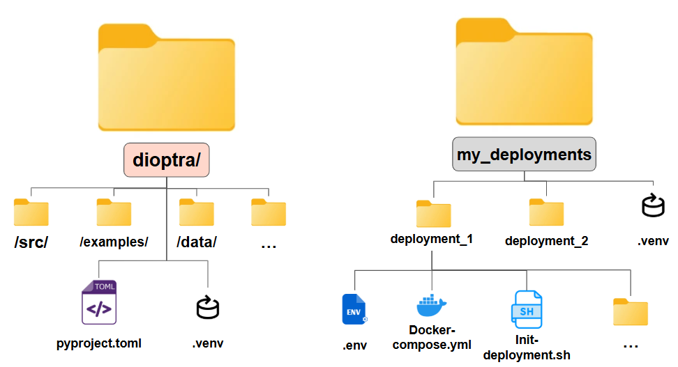

.. This Software (Dioptra) is being made available as a public service by the
.. National Institute of Standards and Technology (NIST), an Agency of the United
.. States Department of Commerce. This software was developed in part by employees of
.. NIST and in part by NIST contractors. Copyright in portions of this software that
.. were developed by NIST contractors has been licensed or assigned to NIST. Pursuant
.. to Title 17 United States Code Section 105, works of NIST employees are not
.. subject to copyright protection in the United States. However, NIST may hold
.. international copyright in software created by its employees and domestic
.. copyright (or licensing rights) in portions of software that were assigned or
.. licensed to NIST. To the extent that NIST holds copyright in this software, it is
.. being made available under the Creative Commons Attribution 4.0 International
.. license (CC BY 4.0). The disclaimers of the CC BY 4.0 license apply to all parts
.. of the software developed or licensed by NIST.
..
.. ACCESS THE FULL CC BY 4.0 LICENSE HERE:
.. https://creativecommons.org/licenses/by/4.0/legalcode

.. _how-to-prepare-deployment:

Prepare Your Deployment
=======================

This guide explains how to create and configure a Dioptra deployment using the cruft template system.
After completing these steps, you will have a deployment folder ready to start.

Prerequisites
-------------

* Python 3.11+ virtual environment with the ``cruft`` package installed (``pip install cruft``)
* `Docker Engine <https://docs.docker.com/engine/install/>`__ and `Docker Compose <https://docs.docker.com/compose/install/>`__ installed
* :ref:`how-to-get-container-images` - Container images available (downloaded or built)
* A terminal with access to the deployment target directory

Deployment Setup
----------------

Organizing your Deployments 
~~~~~~~~~~~~~~~~~~~~~~~~~~~

In Dioptra, a **Deployment** is a configured instance of Dioptra. Multiple deployments can be maintained in isolated environments on a single host. 

You will create a deployments folder on your machine independent of (or nested within) the Dioptra repository :ref:`you previously cloned <how-to-download-container-images-clone-the-repository>`.

**File Structure Overview** 

   Your deployments folder can be nested within ``dioptra/`` or be located elsewhere. 

Create a Deployment
------------------------

.. rst-class:: header-on-a-card header-steps

Step 1: Create the Deployment Directory
~~~~~~~~~~~~~~~~~~~~~~~~~~~~~~~~~~~~~~~

If not already created, make the folder where you plan to keep your deployment(s) and change into it so that it becomes your working directory.

.. code:: sh

   mkdir -p /path/to/deployments/folder
   cd /path/to/deployments/folder

.. rst-class:: header-on-a-card header-steps

Step 2: Create a Virtual Environment and Install Dependencies
~~~~~~~~~~~~~~~~~~~~~~~~~~~~~~~~~~~~~~~

Cruft is required to create the deployment. 

.. code:: sh

   uv venv 
   source .venv/bin/activate
   uv pip install cruft
   

.. rst-class:: header-on-a-card header-steps

Step 3: Choose Deployment Branch
~~~~~~~~~~~~~~~~~~~~~~~~~~~~~~~~~~~~~~~

Export the branch name as an environment variable

.. tabs::

   .. tab:: Stable Releases

      .. code:: sh

         export BRANCH="main"

   .. tab:: Developer Builds

      .. code:: sh

         export BRANCH="dev"

.. rst-class:: header-on-a-card header-steps

Step 4: Apply the Template
~~~~~~~~~~~~~~~~~~~~~~~~~~

Run cruft to apply the Dioptra Deployment template. There are four different methods for configuring the deployment:

* **Method 1**: Interactive prompts for each variable
* **Method 2**: Use all default template values 
* **Method 3**: Use all default template values, except values which are overridden in command line 
* **Method 4**: Use all default template values, except values which are provided in config file

Choose a method and then create the deployment by applying the template:

.. tabs::

   .. tab:: Method 1: All specified

      .. code:: sh

         cruft create https://github.com/usnistgov/dioptra --checkout $BRANCH \
         --directory cookiecutter-templates/cookiecutter-dioptra-deployment

   .. tab:: Method 2: Default values

      .. code:: sh

         cruft create https://github.com/usnistgov/dioptra --checkout $BRANCH \
         --directory cookiecutter-templates/cookiecutter-dioptra-deployment --no-input

   .. tab:: Method 3: Override via CLI

      .. code:: sh

         cruft create https://github.com/usnistgov/dioptra --checkout $BRANCH \
         --directory cookiecutter-templates/cookiecutter-dioptra-deployment --no-input \
         --extra-context '{"datasets_directory": "~/datasets"}'

   .. tab:: Method 4: Override via config

      .. code:: sh

         cruft create https://github.com/usnistgov/dioptra --checkout $BRANCH \
         --directory cookiecutter-templates/cookiecutter-dioptra-deployment --no-input \
         --extra-context-file overrides.json

.. tip::

   If you make a mistake, press :kbd:`Ctrl+C` to interrupt cruft, remove any created folder, and start over.

.. rst-class:: header-on-a-card header-steps

Step 5: Configure Template Variables (Method 1 Only)
~~~~~~~~~~~~~~~~~~~~~~~~~~~~~~~~~~~~

If you selected Method 1 (interactive prompts), you will be asked to set configuration variables.
In most cases, the default value is appropriate.

Key variables include:

- **deployment_name:** A name to associate with the deployment (default: ``Dioptra deployment``)
- **container_registry:** Registry prefix for Dioptra container images. Leave as default for downloaded images, or set to empty for locally built images. See :ref:`how-to-get-container-images-registry-prefix` for details. (default: ``ghcr.io/usnistgov``)
- **container_tag:** Should match the tags of your Dioptra container images (default: ``dev``)
- **nginx_server_name:** Domain name, IP address, or ``_`` for local deployments (default: ``dioptra.example.org``)
- **num_tensorflow_cpu_workers / num_pytorch_cpu_workers:** Number of CPU workers (default: ``1`` each)
- **datasets_directory:** Host directory to mount at ``/dioptra/data`` in workers (default: *empty*)

.. admonition:: Learn More

   See :ref:`reference-deployment-template` for complete descriptions of all template variables, including interactive prompt examples and non-interactive configuration methods.

.. rst-class:: header-on-a-card header-steps

Step 6: Initialize the Deployment
~~~~~~~~~~~~~~~~~~~~~~~~~~~~~~~~~

Run the initialization script to generate passwords, copy configuration files, and prepare the named volumes.

**Steps**

1. Navigate into the created deployment

   .. code:: sh

      cd dioptra-deployment  # Or your deployment folder name

2. Run the initialization script 

   .. code:: sh
   
      ./init-deployment.sh --branch $BRANCH

The script automates password generation, certificate bundling, volume preparation, Minio account setup, and built-in plugin syncing.

.. admonition:: Learn More

   See :ref:`reference-init-deployment-script` for complete command-line options and detailed examples.

.. rst-class:: header-on-a-card header-steps

Step 7: Start Dioptra
~~~~~~~~~~~~~~~~~~~~~

Start all Dioptra services:

.. code:: sh

   docker compose up -d

Once the containers are running, open your web browser and navigate to ``http://localhost/`` (or ``https://localhost/`` if SSL/TLS is enabled).

Verify all services are running:

.. code:: sh

   docker compose ps

.. admonition:: Learn More

   See :ref:`reference-deployment-commands` for the full suite of commands to manage your deployment (stop, restart, view logs, etc.).

Next Steps
------------

To test that Dioptra is working, consider progressing through the :ref:`Hello World Tutorial<tutorial-hello-world-in-dioptra>`.

.. rst-class:: header-on-a-card header-seealso

See Also
--------

**How-To Guides:**

* :ref:`how-to-update-deployment` - Update your deployment when new template versions are available

**Reference Documentation:**

* :ref:`reference-deployment-template` - Complete template variable descriptions
* :ref:`reference-deployment-folder` - Deployment folder structure and file descriptions
* :ref:`reference-init-deployment-script` - Initialization script options

**Optional Customizations:**

* :ref:`how-to-using-docker-compose-overrides` - Use override files for customizations
* :ref:`how-to-data-mounts` - Mount data volumes into worker containers
* :ref:`how-to-gpu-enabled-workers` - Configure GPU workers
* :ref:`how-to-adding-certificates` - Add custom CA certificates
* :ref:`how-to-enabling-ssl-tls` - Enable SSL/TLS encryption
* :ref:`how-to-integrating-custom-containers` - Add custom containers
