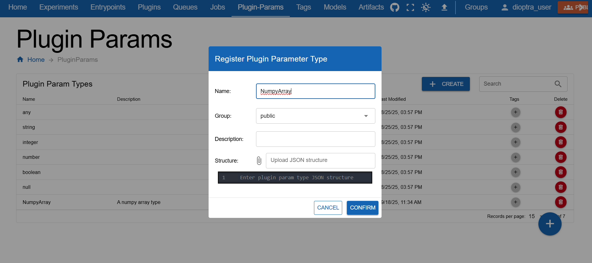
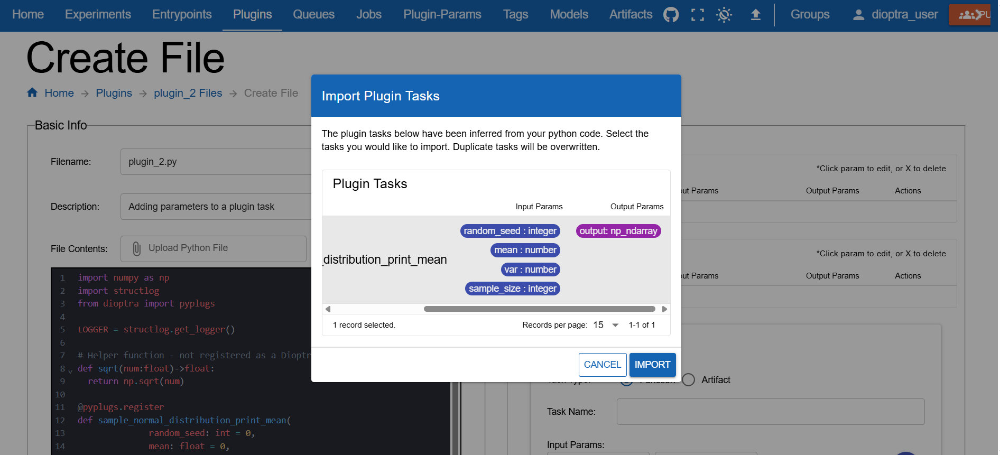
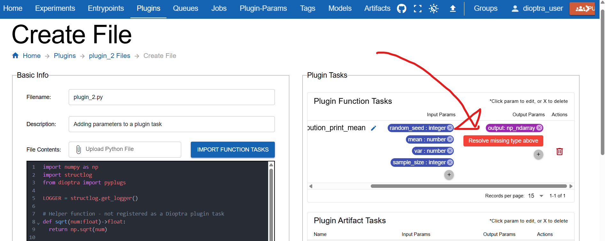
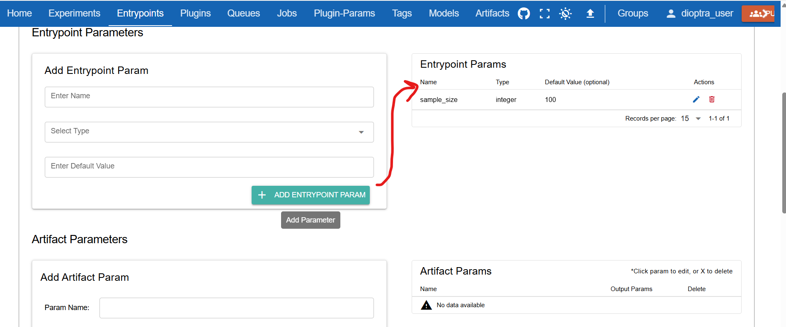
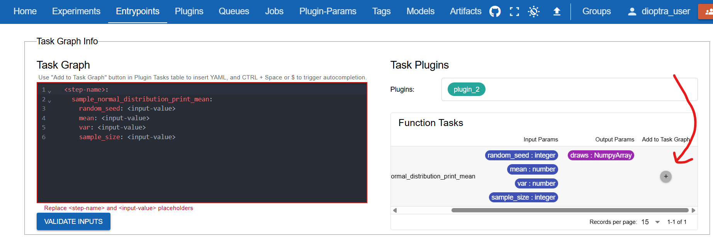
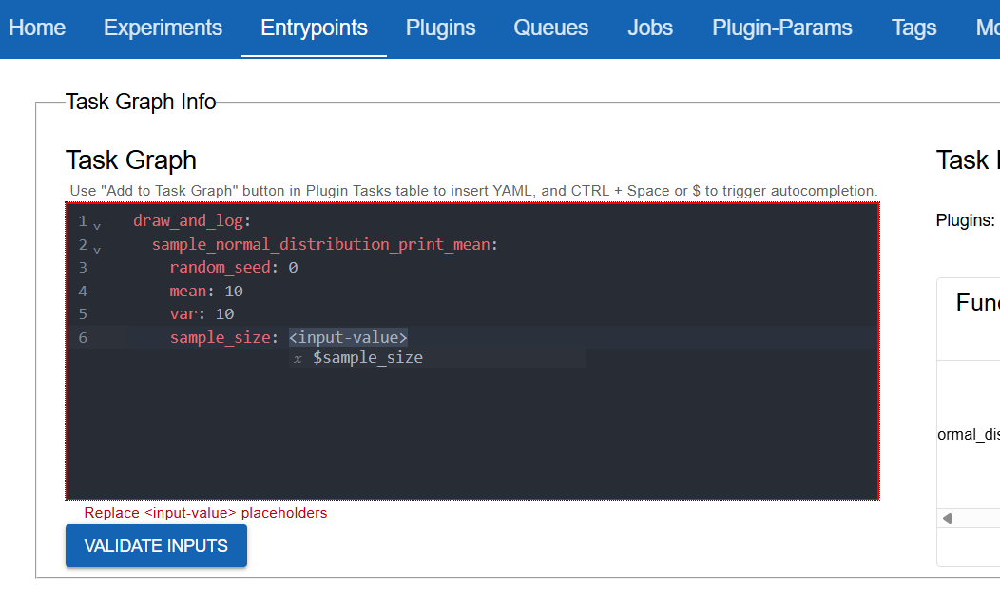
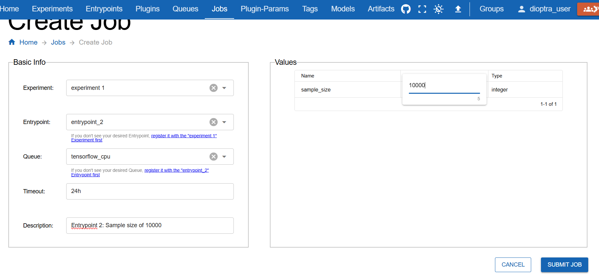
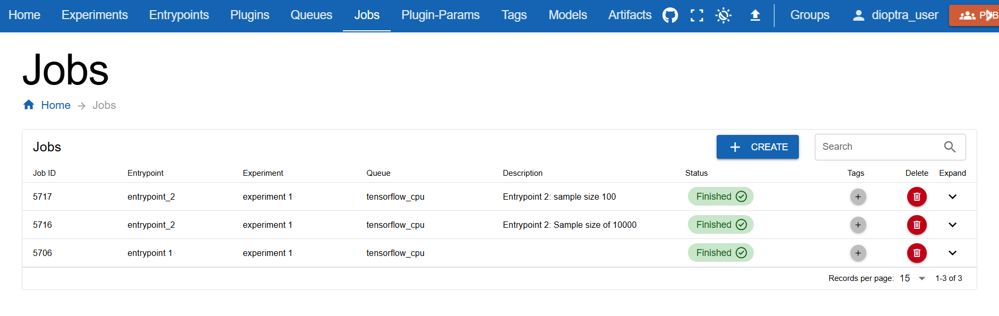

.. This Software (Dioptra) is being made available as a public service by the
.. National Institute of Standards and Technology (NIST), an Agency of the United
.. States Department of Commerce. This software was developed in part by employees of
.. NIST and in part by NIST contractors. Copyright in portions of this software that
.. were developed by NIST contractors has been licensed or assigned to NIST. Pursuant
.. to Title 17 United States Code Section 105, works of NIST employees are not
.. subject to copyright protection in the United States. However, NIST may hold
.. international copyright in software created by its employees and domestic
.. copyright (or licensing rights) in portions of software that were assigned or
.. licensed to NIST. To the extent that NIST holds copyright in this software, it is
.. being made available under the Creative Commons Attribution 4.0 International
.. license (CC BY 4.0). The disclaimers of the CC BY 4.0 license apply to all parts
.. of the software developed or licensed by NIST.
..
.. ACCESS THE FULL CC BY 4.0 LICENSE HERE:
.. https://creativecommons.org/licenses/by/4.0/legalcode

.. _tutorial-adding-inputs-and-outputs:

Adding Inputs and Outputs
=========================

Overview
--------

In the :ref:`Hello World Tutorial <tutorial-hello-world-in-dioptra>`, you created a plugin with one task and ran it through an entrypoint and experiment. Now, you will extend that idea to include **task inputs**, **task outputs**, and **entrypoint parameters**.

This will let you parameterize **input parameters** for a plugin task when running a job. After running multiple jobs, 
you will compare outputs and observe how different **sample sizes** impact the observed sample mean's relationship to its underlying distribution.

Prerequisites
-------------
Before starting, ensure you have set up Dioptra and completed the :ref:`Hello World Tutorial <tutorial-hello-world-in-dioptra>`.

* :ref:`explanation-install-dioptra` - Obtain the Dioptra containers and create a deployment
* :ref:`tutorial-setup-dioptra-in-the-gui` - Create a user and queue in the GUI

Workflow
--------

.. rst-class:: header-on-a-card header-steps

Step 1: Create a New Type
~~~~~~~~~~~~~~~~~~~~~~~~~~~~~~~~~~~~~

Your plugin task will output a Numpy array. Before registering this output in your plugin task, you need to define the type in Dioptra.

1. Navigate to the **Plugin-Params** tab.
2. Click **Create**.
3. Enter the name: ``NumpyArray``.
4. Click **Save**.

   Creating a new type in the UI.

.. admonition:: Learn More

   * :ref:`explanation-plugin-parameter-types` - Learn about parameter types

.. rst-class:: header-on-a-card header-steps

Step 2: Create the Plugin
~~~~~~~~~~~~~~~~~~~~~~~~~~~~~~~~~~~~~

You will now create a new plugin with one task. This task accepts parameters (``random_seed``, ``sample_size``, ``mean``, ``var``), samples a normal distribution, logs the mean, and returns the array.

1. Go to the **Plugins** tab and click **Create Plugin**.
2. Name it ``sample_normal`` and add a short description.
3. Click the **file icon** and add a new Python file named ``sample_normal.py``.
4. Paste the code below into the editor.

.. admonition:: sample_normal.py
    :class: code-panel python

    .. literalinclude:: ../../../../docs/source/documentation_code/plugins/essential_workflows_tutorial/sample_normal.py
       :language: python

.. rst-class:: header-on-a-card header-steps

.. _tutorial-1-part-2-register-the-task:

Step 3: Register the Task
~~~~~~~~~~~~~~~~~~~~~~~~~~~~~~~~~~~~~

Unlike last time, you must specify input and output types. Using Dioptra's autodetect functionality will help here.

1. Click **Import Function Tasks** (top right of the editor) to auto-detect functions from ``sample_normal.py``.

   Using "Import Tasks" to automatically detect and register plugin tasks.

.. note::
   Input and output types are auto-detected from **Python type hints** and the **return annotation** (``->``).

2. You may see an error under **Plugin Tasks**: *Resolve missing type* for the ``np_ndarray`` output. This is because the custom type is called ``NumpyArray``, not ``np_ndarray``, which is the default name inferred from the return type.

   The output type was detected as np_ndarray, but the type you created is called NumpyArray.

**Fix the mismatched param type**:

* Click the ``output`` badge.
* Set **Name** to ``output`` and **Type** to ``NumpyArray``.

Once you've corrected the errors, **save** the plugin file.

.. admonition:: Learn More

   * :ref:`reference-plugins` - More syntax specifics on creating plugins

.. rst-class:: header-on-a-card header-steps

Step 4: Create Entrypoint Parameters
~~~~~~~~~~~~~~~~~~~~~~~~~~~~~~~~~~~~~

You will create an entrypoint that accepts a parameter, allowing you to change the sample size without changing the code.

1. Navigate to **Entrypoints** and click **Create Entrypoint**.
2. Name it ``sample_normal_ep``.
3. In the **Entrypoint Parameters** window, click **Add Parameter**:

   - **Name:** ``sample_size``
   - **Type:** ``int``
   - **Default value:** ``100``

   Creating an entrypoint parameter allows the parameter to be changed during a job run.

.. rst-class:: header-on-a-card header-steps

Step 5: Define Task Graph
~~~~~~~~~~~~~~~~~~~~~~~~~~~~~~~~~~~~~

Now add the task to the graph and bind the parameters.

1. In the **Task Plugins** window, select ``sample_normal``.
2. Click **Add to Task Graph**. This auto-populates the YAML with default structure.

   Using "Add To Task Graph" to automatically populate the YAML editor.

3. Edit the YAML to bind the parameters. Map ``sample_size`` to the entrypoint parameter (``$sample_size``) and hardcode the others.

   Binding the task parameters in the YAML editor.

4. Ensure the task graph is valid by clicking **Validate Inputs**
5. Click **Submit Entrypoint**.

.. rst-class:: header-on-a-card header-steps

Step 6: Run Jobs
~~~~~~~~~~~~~~~~~~~~~~~~~~~~~~~~~~~~~

You will reuse the existing experiment to run two jobs with different parameters.

1. Navigate to **Sample Normal**.
2. In the **Entrypoints** list, verify ``sample_normal_ep`` is available (if not, add it).
3. Click **Create Job**.
4. Select ``sample_normal_ep``.
5. Set the ``sample_size`` parameter to ``10000``.
6. Click **Submit Job**.

   Setting the sample size parameter for a job to 10,000.

7. Create a **second job** using ``sample_normal_ep``, but this time leave ``sample_size`` at the default ``100``.

   Jobs queue, start, and finish.

.. rst-class:: header-on-a-card header-steps

Step 7: Inspect Results
~~~~~~~~~~~~~~~~~~~~~~~~~~~~~~~~~~~~~

Once the jobs finish, inspect the logs for each.

**Job with Sample Size 100:**

.. admonition:: Log Output (Small Sample)
   :class: code-panel console

   .. code-block:: console

      Plugin 2 - The mean value of the draws was 10.2565, which was 0.2565 different from the passed-in mean (2.56%). [Passed-in Parameters]Seed: 0; Mean: 10; Variance: 10; Sample Size: 100

**Job with Sample Size 10,000:**

.. admonition:: Log Output (Large Sample)
   :class: code-panel console

   .. code-block:: console

      Plugin 2 - The mean value of the draws was 9.9971, which was 0.0029 different from the passed-in mean (0.03%). [Passed-in Parameters]Seed: 0; Mean: 10; Variance: 10; Sample Size: 100000

Notice that the sample mean was much closer to the distribution mean when the sample size was larger.

.. note::
   This experiment illustrates the **Law of Large Numbers**: as the sample size increases, the sample mean tends to get closer to the population mean.

Conclusion
----------

You now know how to:

- Define custom types
- Register Plugin Tasks with inputs and outputs
- Run Entrypoints and Jobs with parameters

Next, :ref:`you'll chain multiple tasks together <tutorial-building-a-multi-step-workflow>` into a single workflow.