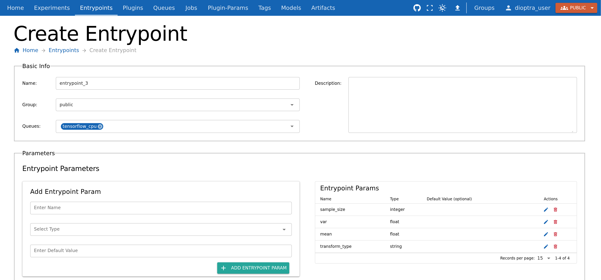
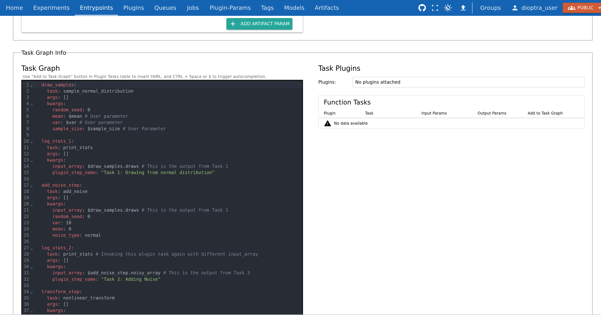
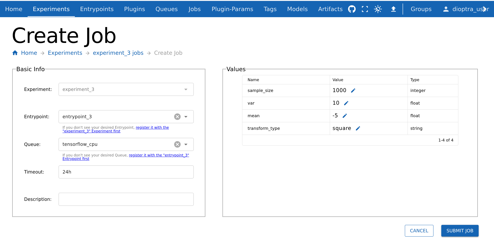

.. This Software (Dioptra) is being made available as a public service by the
.. National Institute of Standards and Technology (NIST), an Agency of the United
.. States Department of Commerce. This software was developed in part by employees of
.. NIST and in part by NIST contractors. Copyright in portions of this software that
.. were developed by NIST contractors has been licensed or assigned to NIST. Pursuant
.. to Title 17 United States Code Section 105, works of NIST employees are not
.. subject to copyright protection in the United States. However, NIST may hold
.. international copyright in software created by its employees and domestic
.. copyright (or licensing rights) in portions of software that were assigned or
.. licensed to NIST. To the extent that NIST holds copyright in this software, it is
.. being made available under the Creative Commons Attribution 4.0 International
.. license (CC BY 4.0). The disclaimers of the CC BY 4.0 license apply to all parts
.. of the software developed or licensed by NIST.
..
.. ACCESS THE FULL CC BY 4.0 LICENSE HERE:
.. https://creativecommons.org/licenses/by/4.0/legalcode

.. _tutorial-building-a-multi-step-workflow:

Building a Multi-Step Workflow
==============================

Overview
--------

So far, you have built plugins with a single task and connected them to an Entrypoint. Now, you will extend the idea further by creating a **multi-task plugin** and chaining those tasks together in an Entrypoint.

This will let you:

- Register **multiple Python functions** as tasks in one Plugin
- **Reference outputs** of earlier tasks as inputs for later tasks
- **Repeat tasks** with different inputs
- See how multiple steps can be **chained together** to make a data generation workflow

We will run the workflow once and inspect how the data evolves across multiple steps.

Workflow
--------

.. rst-class:: header-on-a-card header-steps

Step 1: Make Plugin 3
~~~~~~~~~~~~~~~~~~~~~~~~~~~~~~~~~~~~~

Plugin 3 will include multiple functions, each registered as a Plugin Task.
Other than containing more functions, we create the plugin the same way as before.

The tasks include:

- **sample_normal_distribution**: sample a NumPy array
- **add_noise**: perturb the array with additive noise sampled from a normal distribution
- **nonlinear_transform**: apply a configurable transformation (e.g. square each value)
- **print_stats**: log mean, variance, min, max of the current state of the array

**Steps** 

1. Go to the **Plugins** tab and click **Create Plugin**.
2. Name it ``plugin_3`` and add a short description.
3. Add a new file named ``plugin_3.py`` and paste the code below.
4. Import functions via **Import Function Tasks** (same as in :ref:`tutorial-1-part-2-register-the-task`).

.. admonition:: plugin_3.py
    :class: code-panel python

    .. literalinclude:: ../../../../examples/tutorials/tutorial_1/plugin_3.py
       :language: python

.. rst-class:: header-on-a-card header-steps

Step 2: Create Entrypoint 3
~~~~~~~~~~~~~~~~~~~~~~~~~~~~~~~~~~~~~

Entrypoint 3 will demonstrate a **multi-step task graph**. We will pass arrays from one task to the next and re-use the ``print_stats`` task multiple times.

Parameters for this Entrypoint:

- ``sample_size`` (int)
- ``mean`` (float)
- ``var`` (float)
- ``transform_type`` (str, e.g. ``square``)

**Steps** 

1. Create a new Entrypoint named ``entrypoint_3``.
2. Under the **Entrypoint Parameters** window, add the four parameters listed above, ensuring you select the correct types (``int``, ``float``, ``float``, ``string``).

   Defining entrypoint parameters to use in our Task Graph.

.. rst-class:: header-on-a-card header-steps

Step 3: Build the Task Graph
~~~~~~~~~~~~~~~~~~~~~~~~~~~~~~~~~~~~~

We are going to build a task graph with **six steps**:

1. ``draw_normal`` (generates draws)
2. ``print_stats`` (on array from step 1)
3. ``add_noise`` (adds noise to draws)
4. ``print_stats`` (on array from step 3 with noise added)
5. ``transform`` (applies chosen transform)
6. ``print_stats`` (on array from step 5 after transformation)

Key ideas:

- Reference outputs of earlier tasks (e.g., use ``draws`` from step 1 in step 2).
- Re-use the same task (``print_stats``) multiple times with different inputs.

**Steps** 

1. Go to **Task Graph Info**.
2. Select ``plugin_3`` in the plugins list.
3. Paste the following YAML code into the editor:

.. admonition:: Entrypoint 3 Task Graph YAML
    :class: code-panel yaml

    .. literalinclude:: ../../../../examples/tutorials/tutorial_1/entrypoint_3_task_graph.yaml
       :language: yaml

.. note::
   The output of all our tasks is simply called ``output``. This can be changed during Plugin Task registration if desired.

   Multi-step task graph that repeats Plugin Task "print_stats" three times, each utilizing a different output array.

.. note::
   Notice how the ``$`` syntax is used to reference both **entrypoint parameters** AND the **output of plugin tasks**.

4. Click **Validate Inputs** - it should pass
5. Click **Submit Entrypoint**.

.. rst-class:: header-on-a-card header-steps

Step 4: Create Experiment
~~~~~~~~~~~~~~~~~~~~~~~~~~~~~~~~~~~~~

Because this workflow is conceptually different, let’s make a new experiment.

**Steps** 

1. Navigate to **Experiments** and click **Create Experiment**.
2. Name it ``experiment_3``.
3. Add **Entrypoint 3** to the experiment.
4. Click **Submit Experiment**.

.. rst-class:: header-on-a-card header-steps

Step 5: Run a Job
~~~~~~~~~~~~~~~~~~~~~~~~~~~~~~~~~~~~~

Let’s execute the multi-step workflow.

1. Go to the **Jobs** tab and click **Create Job**.
2. Select **experiment_3** and **entrypoint_3**.
3. Choose parameter values, for example:

   - ``sample_size`` = 1000
   - ``mean`` = -5
   - ``var`` = 10
   - ``transform_type`` = ``square``

4. Click **Submit Job**.

   Creating a new job - any parameter that is not set in the job run will be set to the entrypoint default.

.. rst-class:: header-on-a-card header-steps

Step 6: Inspect Results
~~~~~~~~~~~~~~~~~~~~~~~~~~~~~~~~~~~~~

After the job finishes, check the logs to see the statistics evolve.

.. admonition:: Job Log Outputs
   :class: code-panel console

   .. code-block:: console

      Plugin Task: 'Task 1: Drawing from normal distribution' - The mean value of the array after this step was -5.1519, with std=3.0888, min=-17.3311, max=4.6957, len=1000.

      Plugin Task: 'Task 2: Adding Noise' - The mean value of the array after this step was -5.3038, with std=6.1775, min=-29.6621, max=14.3913, len=1000.

      Plugin Task: 'Task 3: Transforming the array' - The mean value of the array after this step was 66.2917, with std=89.4162, min=0.0002, max=879.8407, len=1000.

**Analysis:**

- After ``add_noise``: min/max shift noticeably, variance increases, mean remains stable.
- After ``transform (square)``: all values change, mean and variance increase dramatically, min shifts upward.

This illustrates how different modifications (noise, transforms) propagate through a data pipeline.

Conclusion
----------

You now know how to:

- Register multiple tasks in a single plugin
- Build a multi-step Entrypoint task graph
- Reference outputs and repeat tasks
- Run experiments with complex workflows

Next, we will learn how to :ref:`save the output of a task as an artifact <tutorial-saving-artifacts>`.