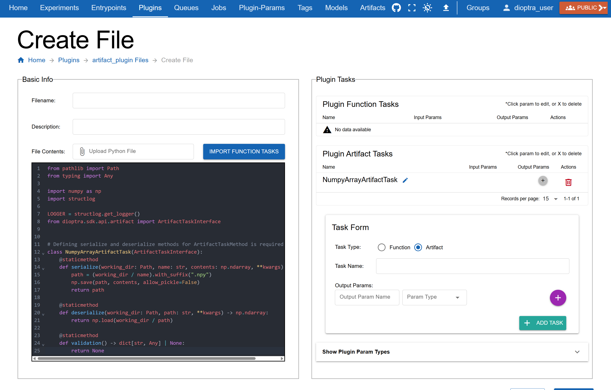
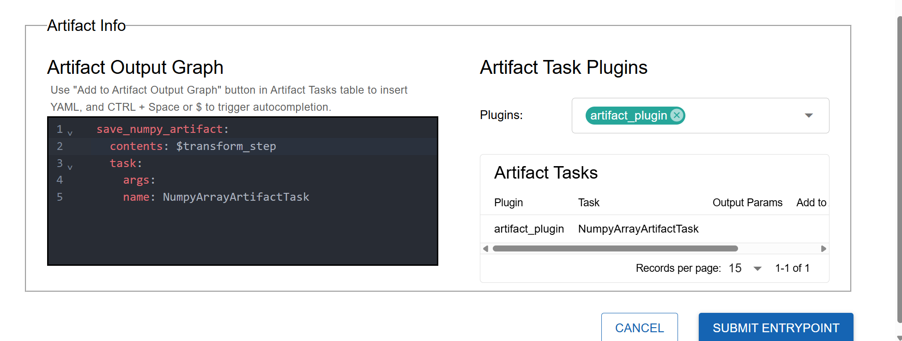
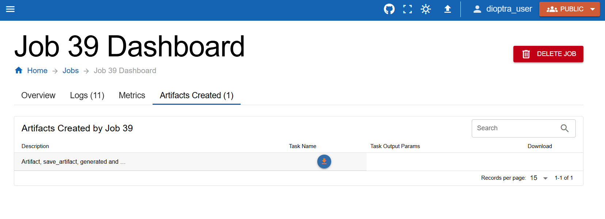

.. This Software (Dioptra) is being made available as a public service by the
.. National Institute of Standards and Technology (NIST), an Agency of the United
.. States Department of Commerce. This software was developed in part by employees of
.. NIST and in part by NIST contractors. Copyright in portions of this software that
.. were developed by NIST contractors has been licensed or assigned to NIST. Pursuant
.. to Title 17 United States Code Section 105, works of NIST employees are not
.. subject to copyright protection in the United States. However, NIST may hold
.. international copyright in software created by its employees and domestic
.. copyright (or licensing rights) in portions of software that were assigned or
.. licensed to NIST. To the extent that NIST holds copyright in this software, it is
.. being made available under the Creative Commons Attribution 4.0 International
.. license (CC BY 4.0). The disclaimers of the CC BY 4.0 license apply to all parts
.. of the software developed or licensed by NIST.
..
.. ACCESS THE FULL CC BY 4.0 LICENSE HERE:
.. https://creativecommons.org/licenses/by/4.0/legalcode

.. _tutorial-saving-artifacts:

Saving Artifacts
================

Overview
--------

In the last section, you created a multi-step workflow and watched how data evolved across chained tasks. Now, you will learn how to **save task outputs as artifacts**.

We will build on :ref:`tutorial-building-a-multi-step-workflow`, adding artifact-saving logic.

.. admonition:: Learn More 

   See :ref:`Artifacts: explanation <explanation-artifacts>` to learn what the purpose of artifacts is. 

Workflow
--------

.. _tutorial-saving-artifacts-step-1-create-an-artifact-plugin:

.. rst-class:: header-on-a-card header-steps

Step 1: Create an Artifact Plugin
~~~~~~~~~~~~~~~~~~~~~~~~~~~~~~~~~~~~~

Before Dioptra can save objects to disk, it needs to know how to serialize and deserialize them. This is handled by an **artifact plugin**.

Just like before, we will create a new plugin, but this time we'll define **artifact tasks**.

1. Go to the **Plugins** tab and click **Create Plugin**.
2. Name it ``artifacts`` and add a short description.
3. Create a new Python file in the plugin.
4. Copy and paste the code below.

.. admonition:: artifacts.py
    :class: code-panel python

    .. literalinclude:: ../../../../examples/documentation_code/plugins/essential_workflows_tutorial/artifacts.py
       :language: python
       :start-after: # [numpy-plugin-definition]
       :end-before: # [end-numpy-plugin-definition]

.. note::
   This plugin defines an artifact task: ``NumpyArrayArtifactTask``.

   To define an artifact task, you must overwrite two methods:

   - **serialize**: convert an in-memory object (e.g., NumPy array) into a file.
   - **deserialize**: read the file back into an object.

   The serialize method should return the path to where the object is saved to disk.

.. admonition:: Learn More 

   See our :ref:`Plugins: reference <reference-plugins>` to guide to learn more about the syntax of Artifact Handlers.

.. rst-class:: header-on-a-card header-steps

Step 2: Register Artifact Task
~~~~~~~~~~~~~~~~~~~~~~~~~~~~~~~~~~~~~

Now we must register the class we just created.

1. In the **Task Form** window (right side of editor), select **Artifact**.
2. Enter the task name: ``NumpyArrayArtifactTask``.
3. For the **output parameter**, add:

   - **Name:** ``output``
   - **Type:** ``NumpyArray``

   Defining an Artifact Task Plugin requires creating a subclass of ``ArtifactTaskInterface``.

.. note::
   Whereas a Plugin task gets its name from the Python function name, an Artifact plugin task gets its name from the subclass name (in this case, ``NumpyArrayArtifactTask``).

   The output parameter type tells Dioptra what kind of object to expect after the ``deserialize`` method is run.

   Learn more in :ref:`Plugins: explanation <explanation-plugins>` and :ref:`Plugins: reference <reference-plugins>`.

4. Click **Save File**.

.. rst-class:: header-on-a-card header-steps

Step 3: Modify Entrypoint to Save Artifacts
~~~~~~~~~~~~~~~~~~~~~~~~~~~~~~~~~~~~~~~~~~~

Next, we will modify **sample_and_transform_ep** to include an artifact-saving task. Nothing about **Plugin 3** itself needs to change.

1. Open **sample_and_transform_ep**.
2. In the **Artifact Info** window, add our new ``artifacts``.
3. Click **Add to Output Graph**.
4. Rename the step to ``save_numpy_artifact``.
5. Set the contents equal to the output from the final step of your task graph (e.g., ``$transform_step`` or whatever the last step was named).

   The Artifact Output Graph defines the logic for which Plugin Tasks should be saved and how. ``contents`` should be a reference to a step name from the task graph.

.. note::
   When the artifact task runs, it automatically calls the ``serialize`` method and writes a file to the artifact store.

.. rst-class:: header-on-a-card header-steps

Step 4: Run Job with Artifact Saving
~~~~~~~~~~~~~~~~~~~~~~~~~~~~~~~~~~~~~

Now let’s try it out.

1. Create a new job using the entrypoint we just defined/edited.
2. Select your desired parameters.
3. Click **Submit Job**.

.. note::
   When an artifact task graph is defined, the logic will execute once all the plugin tasks have completed.

.. rst-class:: header-on-a-card header-steps

Step 5: Inspect the Artifact
~~~~~~~~~~~~~~~~~~~~~~~~~~~~~~~~~~~~~

After the job finishes, click on the job to see the results.

1. Go to the **Artifacts** tab within the Job details.
2. You should see a new artifact file created by the workflow.
3. Download it to confirm it was saved successfully.

   Download the artifact from the Job Dashboard.

A ``.npy`` file should have been downloaded. This is the numpy array after the random noise was added and the transform was applied.

Congratulations — you’ve just saved your first artifact!

Conclusion
----------

You now know how to:

- Create an artifact plugin with **serialize** and **deserialize** methods
- Add artifact tasks into an Entrypoint
- Save task outputs as reusable files
- Verify artifact creation through the Dioptra UI

In the next part, we will :ref:`load artifacts into new entrypoints<tutorial-using-saved-artifacts>`, so results from one workflow can feed directly into another.