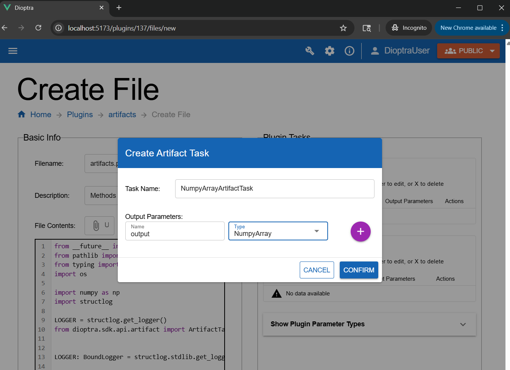
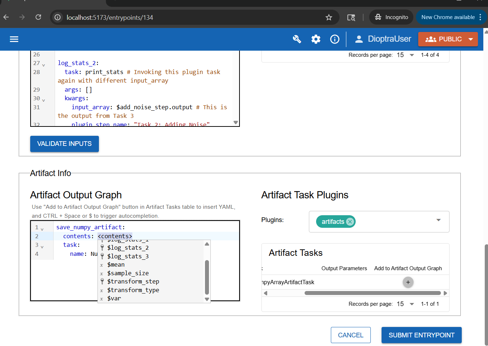
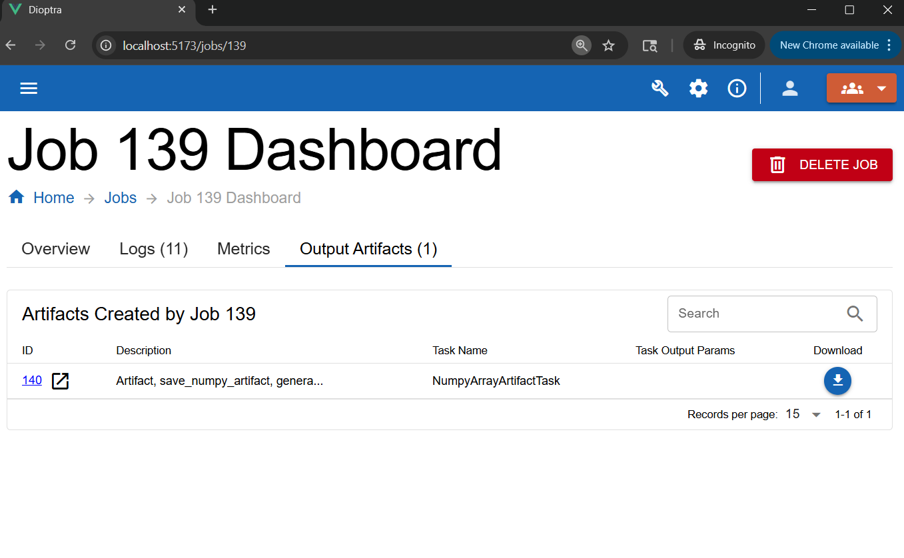

.. This Software (Dioptra) is being made available as a public service by the
.. National Institute of Standards and Technology (NIST), an Agency of the United
.. States Department of Commerce. This software was developed in part by employees of
.. NIST and in part by NIST contractors. Copyright in portions of this software that
.. were developed by NIST contractors has been licensed or assigned to NIST. Pursuant
.. to Title 17 United States Code Section 105, works of NIST employees are not
.. subject to copyright protection in the United States. However, NIST may hold
.. international copyright in software created by its employees and domestic
.. copyright (or licensing rights) in portions of software that were assigned or
.. licensed to NIST. To the extent that NIST holds copyright in this software, it is
.. being made available under the Creative Commons Attribution 4.0 International
.. license (CC BY 4.0). The disclaimers of the CC BY 4.0 license apply to all parts
.. of the software developed or licensed by NIST.
..
.. ACCESS THE FULL CC BY 4.0 LICENSE HERE:
.. https://creativecommons.org/licenses/by/4.0/legalcode

.. _tutorial-saving-artifacts:

Saving Artifacts
================

Overview
--------

In the :ref:`last section <tutorial-building-a-multi-step-workflow>`, you created a multi-step workflow and watched how data evolved across chained tasks. Now, you will learn how to **save task outputs as artifacts**.

This tutorial build on the previous workflow by adding artifact-saving logic.

.. admonition:: Learn More 

   See :ref:`Artifacts Explanation <explanation-artifacts>` to learn about the purpose of artifacts. 

Workflow
--------

.. _tutorial-saving-artifacts-step-1-create-an-artifact-plugin:

.. rst-class:: header-on-a-card header-steps

Step 1: Create an Artifact Plugin
~~~~~~~~~~~~~~~~~~~~~~~~~~~~~~~~~~~~~

Before Dioptra can save objects to disk, it needs to know how to serialize and deserialize them. This is handled by an **Artifact Task**.

Just like before, you will create a new plugin, but this time you'll define **artifact tasks** instead of function tasks..

1. Go to the **Plugins** tab and click **Create**.
2. Name it ``artifacts`` and add a short description.
3. In the ``artifacts`` Plugin, click **create** to make a new Python file - call this file ``artifacts.py`` and add a description.
4. **Copy and paste** the code below.

.. admonition:: artifacts.py
    :class: code-panel python

    .. literalinclude:: ../../../../docs/source/documentation_code/plugins/essential_workflows_tutorial/artifacts.py
       :language: python
       :start-after: # [numpy-plugin-definition]
       :end-before: # [end-numpy-plugin-definition]

5. Do **not** click **Import Function Tasks** - that button does not support Artifact Tasks currently. You will learn how to register Artifact Tasks in the :ref:`next step <tutorial-saving-artifacts-step-2-register-artifact-task>`. 

.. note::
   This plugin defines a single Artifact Task: ``NumpyArrayArtifactTask``.

   To define an Artifact Task, you must override two methods:

   - **serialize**: convert an in-memory object (e.g., NumPy array) into a file.
   - **deserialize**: read the file back into an object.

   The serialize method should return the path to where the object is saved to disk.

   .. admonition:: Learn More 

      See :ref:`Plugins Reference <reference-plugins>` to learn more about the syntax of artifact handlers.

.. _tutorial-saving-artifacts-step-2-register-artifact-task:

.. rst-class:: header-on-a-card header-steps

Step 2: Register Artifact Task
~~~~~~~~~~~~~~~~~~~~~~~~~~~~~~~~~~~~~

Now you must register the class you just created.

1. In the **Plugin Artifact Tasks** window, click **Create**.
2. Enter the task name: ``NumpyArrayArtifactTask``.
3. For the **output parameter**, add:

   - **Name:** ``output``
   - **Type:** ``NumpyArray``

**Click the purple plus** button to add the output parameter. Click **Confirm** to finish registration.

   Defining an artifact task plugin requires creating a subclass of ``ArtifactTaskInterface``.

.. note::
   Whereas a Plugin Task gets its name from the *Python function name*, an Artifact Plugin Task gets its name from the *subclass name* (in this case, ``NumpyArrayArtifactTask``).

   The output parameter type tells Dioptra what kind of object to expect after the ``deserialize`` method is run.

   .. admonition:: Learn More 

      Learn more in :ref:`Plugins Explanation <explanation-plugins>` and :ref:`Plugins Reference <reference-plugins>`.

4. Click **Submit File** to save the Plugin File.

.. rst-class:: header-on-a-card header-steps

Step 3: Modify Entrypoint to Save Artifacts
~~~~~~~~~~~~~~~~~~~~~~~~~~~~~~~~~~~~~~~~~~~

Next, you will modify **sample_and_transform_ep** to include an artifact-saving task. Nothing about the :ref:`sample_and_transform Plugin <tutorial-building-a-multi-step-workflow-step-1-make-sample-and-transform-plugin>` itself needs to change.

1. Open ``sample_and_transform_ep`` from the :ref:`previous tutorial step <tutorial-building-a-multi-step-workflow-step-2-create-sample-and-transform-entrypoint>`
2. Scroll down. In the **Artifact Info** window, select your new ``artifacts`` Plugin.
3. Click **Add to Output Graph**.
4. Rename the step to ``save_numpy_artifact``.
5. Set the contents equal to the output from the final step of your task graph (e.g., ``$transform_step`` or whatever the last step was named).

   The Artifact Output Graph defines the logic for which plugin tasks should be saved and how. ``contents`` should be a reference to a step name from the task graph.

6. Click **Submit Entrypoint** to save your changes. 

.. note::
   When the artifact task runs, it automatically calls the ``serialize`` method and writes a file to the artifact store.

.. rst-class:: header-on-a-card header-steps

Step 4: Run Job with Artifact Saving
~~~~~~~~~~~~~~~~~~~~~~~~~~~~~~~~~~~~~

Now you can try out the Artifact saving logic.

1. Navigate back to your **Experiments** and select the ``Sample and Transform Exp`` from the :ref:`previous step <tutorial-building-a-multi-step-workflow>`.
2. Create a **new job** using the entrypoint you just edited (``sample_and_transform_ep``).
3. Select your **desired parameters** - for example:

   - ``sample_size`` = **1000**
   - ``mean`` = **-5**
   - ``var`` = **10**
   - ``transform_type`` = **"square"**

4. Add a **description**, then click **Submit Job**.
   
   * Note: Ignore the **Artifact Parameters** editor - this is for loading past Artifacts as *inputs*, something that will be explained in the :ref:`next step <tutorial-using-saved-artifacts>`

.. note::
   When an artifact task graph is defined, the logic will execute once all the plugin tasks have completed.

.. rst-class:: header-on-a-card header-steps

Step 5: Inspect the Artifact
~~~~~~~~~~~~~~~~~~~~~~~~~~~~~~~~~~~~~

After the job finishes, click on the job to see the results.

1. Go to the **Artifacts** tab within the job details.
2. You should see a new artifact file created by the workflow.
3. **Download** it to confirm it was saved successfully.

   Download the artifact from the Job Dashboard.

A ``.npy`` file should have been downloaded. This is the numpy array after the random noise was added and the transform was applied.

Congratulations — you've just saved your first artifact!

Conclusion
----------

You now know how to:

- Create an artifact plugin with **serialize** and **deserialize** methods
- **Add artifact tasks** into an Entrypoint
- **Save task outputs** as reusable files
- **Verify artifact creation** through the Dioptra UI

In the next part, you will :ref:`load artifacts into new entrypoints<tutorial-using-saved-artifacts>`, so results from one workflow can feed directly into another.