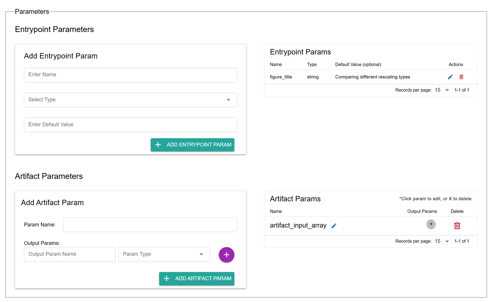
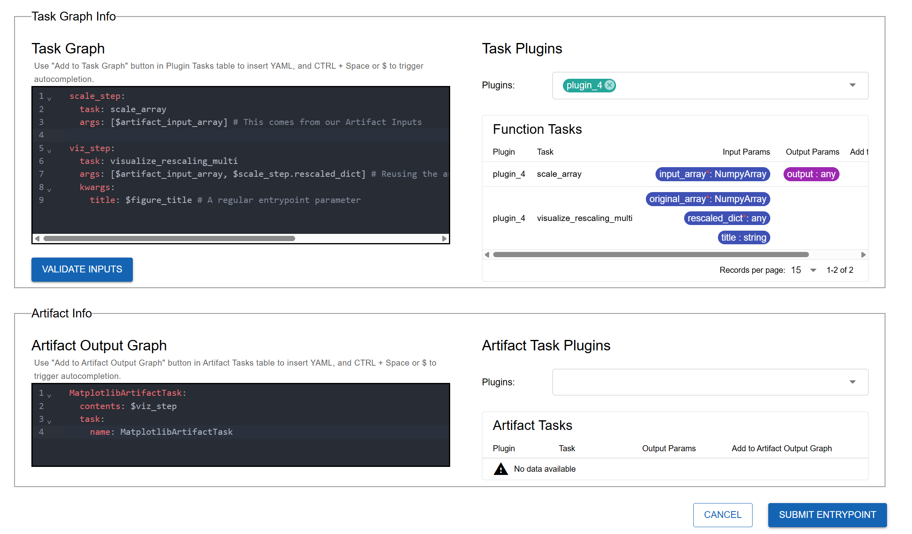
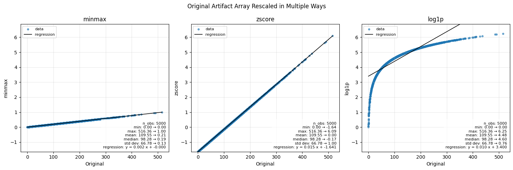

.. This Software (Dioptra) is being made available as a public service by the
.. National Institute of Standards and Technology (NIST), an Agency of the United
.. States Department of Commerce. This software was developed in part by employees of
.. NIST and in part by NIST contractors. Copyright in portions of this software that
.. were developed by NIST contractors has been licensed or assigned to NIST. Pursuant
.. to Title 17 United States Code Section 105, works of NIST employees are not
.. subject to copyright protection in the United States. However, NIST may hold
.. international copyright in software created by its employees and domestic
.. copyright (or licensing rights) in portions of software that were assigned or
.. licensed to NIST. To the extent that NIST holds copyright in this software, it is
.. being made available under the Creative Commons Attribution 4.0 International
.. license (CC BY 4.0). The disclaimers of the CC BY 4.0 license apply to all parts
.. of the software developed or licensed by NIST.
..
.. ACCESS THE FULL CC BY 4.0 LICENSE HERE:
.. https://creativecommons.org/licenses/by/4.0/legalcode

.. _tutorial-using-saved-artifacts:

Using Saved Artifacts
=====================

Overview
--------

In the last section, you learned how to save task outputs as artifacts. Now, you will take the next step: **using a saved artifact as input in a new workflow**.

This is done through **artifact parameters**. They behave like entrypoint parameters, but instead of being set at job creation, they are **loaded from disk**. You can then reference them throughout the task graph.

Using Saved Artifacts in an Entrypoint Task Graph 
~~~~~~~~~~~~~~~~~~~~~~~~~~~~~~~~~~~~~~~~~~~~~~~~~

In this example, you will build a new workflow that:

- **Loads** a NumPy array **artifact** that was saved from :ref:`tutorial-saving-artifacts`
- Applies **multiple rescaling methods**
- **Visualizes** the results with Matplotlib
- **Saves** the resulting **figure as a new artifact**

To accomplish this, you'll need to perform the following:

- **Create a new Artifact Handler** that is capable of serializing Matplotlib figures 
- **Define a new Plugin** that reads in a Numpy array as an input and produces a Matplotlib figure as an artifact 
- **Define a new Entrypoint** to use the new plugin and new artifact handler

Once all that is done, we can run a job for this entrypoint and select the previously saved NumPy Array as the Artifact Input Parameter. 

Workflow
--------

.. rst-class:: header-on-a-card header-steps

Step 1: Add a New Plugin-Param Type
~~~~~~~~~~~~~~~~~~~~~~~~~~~~~~~~~~~~~

You'll use the python ``dict`` type in your next plugin, so go ahead and add it.

1. Go to the **Plugin-Params** tab.
2. Create a new type called ``dict``.
3. Click **Save**.

.. rst-class:: header-on-a-card header-steps

Step 2: Create the "rescale_and_graph_array" Plugin
~~~~~~~~~~~~~~~~~~~~~~~~~~~~~~~~~~~~~

You want to create a plugin that utilizes a saved numpy array as an *input*.

1. Go to the **Plugins** tab and click **Create Plugin**.
2. Name it ``rescale_and_graph_array`` and add a short description.
3. Create a new file named ``rescale_and_graph_array.py``.
4. Copy and paste the code below.
5. Import the functions via **Import Function Tasks**. Fix any types as needed.

.. admonition:: rescale_and_graph_array.py
    :class: code-panel python

    .. literalinclude:: ../../../../docs/source/documentation_code/plugins/essential_workflows_tutorial/rescale_and_graph_array.py
       :language: python

.. note::
   This plugin defines two new tasks:

   - ``scale_array``: to rescale the input array three different ways.
   - ``visualize_rescaling_multi``: to visualize all the rescaled arrays.

.. rst-class:: header-on-a-card header-steps

Step 3: Add Another Artifact Task
~~~~~~~~~~~~~~~~~~~~~~~~~~~~~~~~~~~~~

Your second plugin task outputs a Matplotlib figure. To view this output, you need to save it as an artifact. You will add a new artifact plugin task that serializes a matplotlib object as a png.

1. Open your ``artifacts`` from the previous tutorial :ref:`step <tutorial-saving-artifacts-step-1-create-an-artifact-plugin>`.
2. Add the new artifact plugin class code to the bottom of the file to define ``MatplotlibArtifactTask``.
3. Register it in your plugin the same way as the ``NumpyArrayArtifactTask`` (see :ref:`tutorial-1-part-4-register-artifact-task`).

**Add this class to the bottom of the file:**

.. admonition:: artifacts.py (add to bottom)
    :class: code-panel python

    .. literalinclude:: ../../../../docs/source/documentation_code/plugins/essential_workflows_tutorial/artifacts.py
       :language: python
       :start-after: # [matplotlib-plugin-definition]
       :end-before: # [end-matplotlib-plugin-definition]

.. rst-class:: header-on-a-card header-steps

Step 4: Create "rescale_and_graph_array" Entrypoint
~~~~~~~~~~~~~~~~~~~~~~~~~~~~~~~~~~~~~

Now define a new entrypoint that loads the array, transforms it, and saves the plot.

1. Go to the **Entrypoints** tab and click **Create Entrypoint**.
2. Name it ``rescale_and_graph_array_ep``.

**Add Parameters:**

3. In the **Entrypoint Parameters** box, add:

   - **Name:** ``figure_title``
   - **Type:** ``string``
   - **Default:** ``"Comparing rescaling methods plot"``

4. In the **Artifact Parameters** box, add the input parameter:

   - **Artifact parameter name:** ``artifact_input_array``
   - **Output parameter name:** ``artifact_input_array``
   - **Output parameter type:** ``NumpyArray``

   Create one entrypoint parameter and one artifact parameter.

.. note::
   The specific artifact instantiated for a given artifact entrypoint parameter is decided at job runtime.

**Define Task Graph:**

5. In the **Task Plugins** and **Artifact Task Plugins** windows, select the relevant plugins.
6. Copy the **Task Graph** YAML below into the editor. It rescales your artifact input parameter in three different ways and plots the results.

.. admonition:: rescale_and_graph_array_ep: Task Graph YAML
    :class: code-panel yaml

    .. literalinclude:: ../../../../docs/source/documentation_code/task_graphs/essential_workflows_tutorial/rescale_and_graph_array.yaml
       :language: yaml

.. note::
   Note the reference to ``$artifact_input_array`` in the task graph. This is referencing the loaded artifact.

**Define Artifact Output Graph:**

7. Copy the **Artifact Output Graph** YAML below. It saves the generated matplotlib figure from step 2.

.. admonition:: rescale_and_graph_array: Artifact Output Task Graph YAML
    :class: code-panel yaml

    .. literalinclude:: ../../../../examples/tutorials/tutorial_1/entrypoint_5_artifact_output_task_graph.yaml
       :language: yaml

8. Click **Validate Inputs**.
9. Click **Submit Entrypoint**.

   Defining the logic for the workflow and the artifact saving.

.. rst-class:: header-on-a-card header-steps

Step 5: Create Experiment and Job
~~~~~~~~~~~~~~~~~~~~~~~~~~~~~~~~~~~~~

Finally, test it out.

1. Create a new Experiment named ``Rescale and Graph Array exp``.
2. Add **rescale_and_graph_array_ep**.
3. Create a new job.
4. When configuring the job, use the **Artifacts** dropdown to select the artifact snapshot created in :ref:`the previous step <tutorial-saving-artifacts>`.
5. Click **Submit Job**.

.. This screenshot does not currently exist at the path

.. figure:: _static/screenshots/job_select_artifact.png
   :alt: Screenshot of job configuration showing artifact snapshot selection.
   :width: 100%
   :figclass:  border-image clickable-image

   Selecting the input artifact at runtime.

.. rst-class:: header-on-a-card header-steps

Step 6: Inspect Results
~~~~~~~~~~~~~~~~~~~~~~~~~~~~~~~~~~~~~

After running the job, open the logs and artifact view.

The original NumPy array artifact from the :ref:`the previous workflow <tutorial-saving-artifacts>` ranged from roughly 0 to 500+. Here's how the three scaling methods reshape it:

- **Min-Max Scaling**: Linearly maps values into [0,1], preserving relative spacing.
- **Z-Score Scaling**: Centers data at 0 with unit variance; shows distance from the mean.
- **Log1p Scaling**: Nonlinear compression; reduces the impact of large values and outliers.

**Artifact Output from rescale_and_graph_array_ep**

   The artifact that was generated from this entrypoint - a Matplotlib figure showing the various rescaling methods.

Conclusion
----------

You now know how to:

- Define new plugins for additional data transformations
- Extend the artifact plugin to handle new object types (e.g., Matplotlib figures)
- Create entrypoints that use artifact parameters as inputs
- Chain workflows together across experiments using artifacts

**Tutorial complete!**
You're now ready to design your own workflows in Dioptra by combining multiple plugins, artifacts, and experiments.

.. rst-class:: header-on-a-card header-seealso

Keep Learning 
---------
This tutorial demonstrated the core functionalities of Dioptra. To see a more interesting and complicated use of
these capabilities, view the :ref:`Dioptra OPTIC: Adversarial ML Attacks and Defenses <tutorial-optic-adversarial-ml>` reference implementation. 