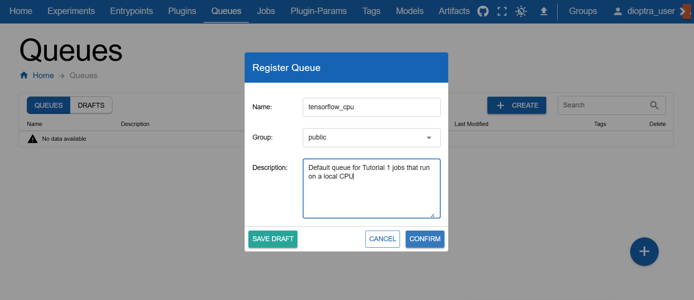

.. This Software (Dioptra) is being made available as a public service by the
.. National Institute of Standards and Technology (NIST), an Agency of the United
.. States Department of Commerce. This software was developed in part by employees of
.. NIST and in part by NIST contractors. Copyright in portions of this software that
.. were developed by NIST contractors has been licensed or assigned to NIST. Pursuant
.. to Title 17 United States Code Section 105, works of NIST employees are not
.. subject to copyright protection in the United States. However, NIST may hold
.. international copyright in software created by its employees and domestic
.. copyright (or licensing rights) in portions of software that were assigned or
.. licensed to NIST. To the extent that NIST holds copyright in this software, it is
.. being made available under the Creative Commons Attribution 4.0 International
.. license (CC BY 4.0). The disclaimers of the CC BY 4.0 license apply to all parts
.. of the software developed or licensed by NIST.
..
.. ACCESS THE FULL CC BY 4.0 LICENSE HERE:
.. https://creativecommons.org/licenses/by/4.0/legalcode

.. _tutorial-setup-dioptra-in-the-gui:

Setup Dioptra in the GUI
=====================

Before running your first plugin task, we need to prepare the environment.

Prerequisites
-------------
Before completing this tutorial, ensure you have installed Dioptra and created a deployment. 

* :ref:`explanation-install-dioptra`

Setup Dioptra Workflow
----------------------

.. rst-class:: header-on-a-card header-steps

Step 1: Start Dioptra Services
~~~~~~~~~~~~~~~~~~~~~~~~~~~~~~~~~~~~~

In your terminal, navigate to your deployment folder. The deployment folder should have 
several ``docker-compose*.yml`` files in it and an ``envs/`` folder with certificates and credentials
for the microservices. 

.. code-block:: bash

   cd path/to/deployment-folder

Once in the deployment folder, start the Docker containers:

.. code-block:: bash

   docker compose up

You should now be able to access the Dioptra web GUI in your browser. 
In the address bar, enter the configured port (default port: http://127.0.0.1).
The Dioptra login screen should appear.

.. figure:: _static/screenshots/login_dioptra.png
   :alt: Screenshot of the Dioptra login page with sign-in and sign-up options.
   :width: 900px
   :figclass: border-image clickable-image

   The Dioptra login screen in the GUI. 

.. admonition:: Learn More

   * :ref:`how-to-prepare-deployment` - Learn about the deployment configuration options 

.. rst-class:: header-on-a-card header-steps

Step 2: Login or Sign Up
~~~~~~~~~~~~~~~~~~~~~~~~~~~~~~~~~~~~~

After opening the web GUI, either **log in** with an existing account or **sign up** for a new one.

.. admonition:: Learn More 

   * :ref:`explanation-users-and-groups` - Explanation of users and groups 
   * :ref:`how-to-create-users-and-groups` - Detailed instructions on creating users and groups 
      
.. rst-class:: header-on-a-card header-steps   

Step 3: Create a Queue
~~~~~~~~~~~~~~~~~~~~~~~~~~~~~~~~~~~~~

Navigate to the **Queues** tab and create a new queue:

- **Name:** `tensorflow_cpu`  
- **Visibility:** Public  

We call it `tensorflow_cpu` because this tutorial assumes only CPU resources are available.  
By making it **public**, all users in the Public group can submit jobs to it.

.. admonition:: Learn More 

   * :ref:`how-to-create-queues` - Instructions on customizing queues and workers
   * :ref:`explanation-queues-and-workers` - Explanation on Queues and Workers 
   * :ref:`how-to-using-custom-workers` - Connect custom workers in Dioptra

Next Steps
----------

Now that Dioptra is set up, let's begin: :ref:`tutorial-running-hello-world`