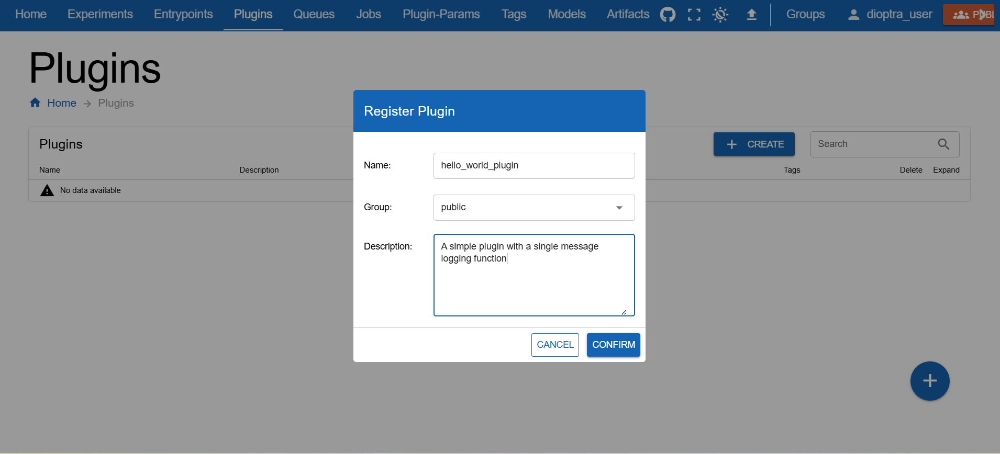
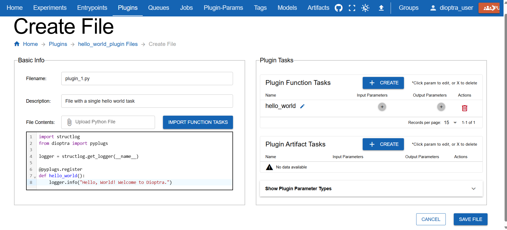
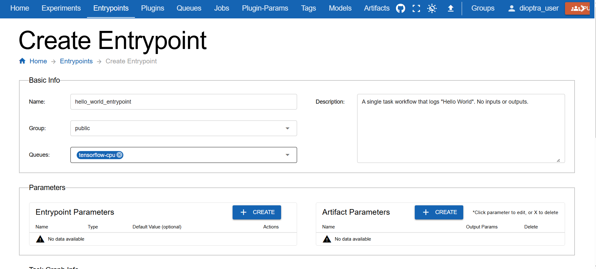
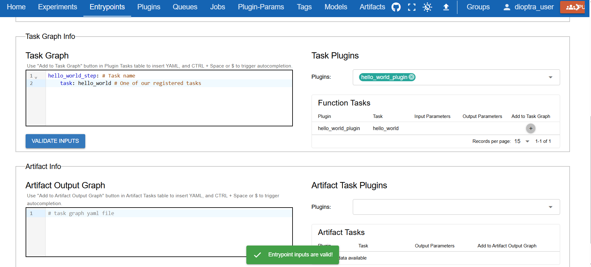
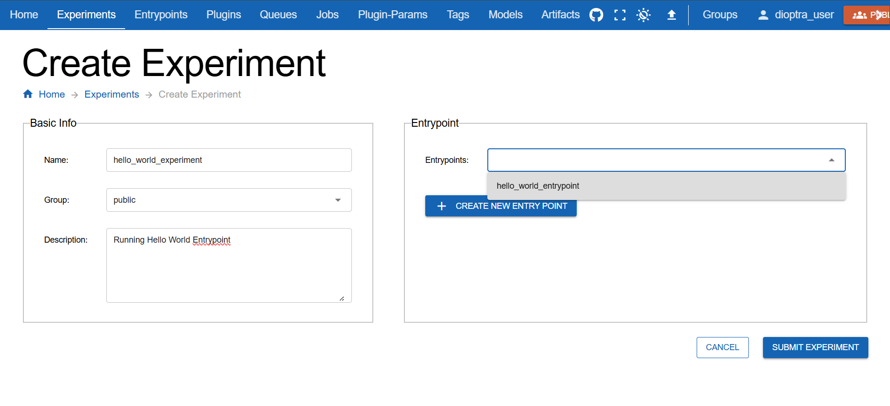
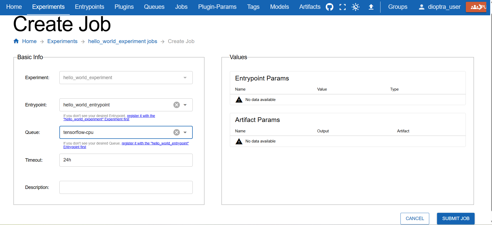
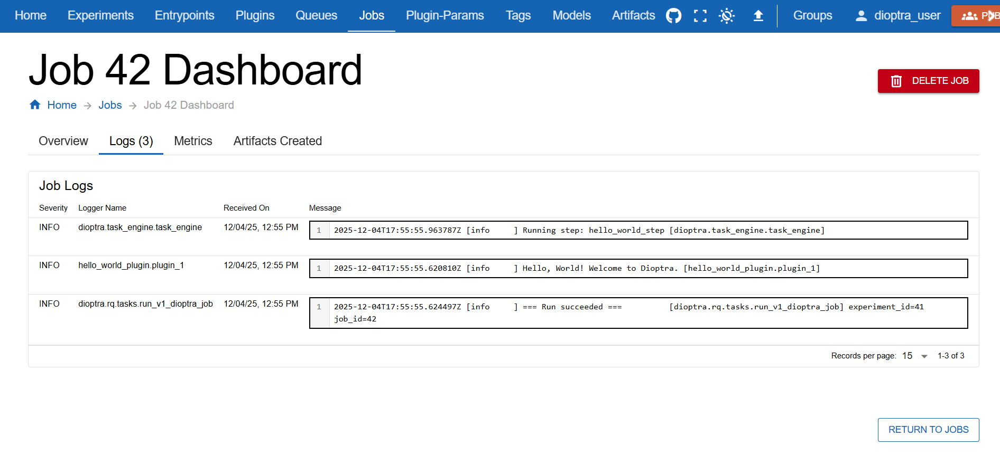

.. This Software (Dioptra) is being made available as a public service by the
.. National Institute of Standards and Technology (NIST), an Agency of the United
.. States Department of Commerce. This software was developed in part by employees of
.. NIST and in part by NIST contractors. Copyright in portions of this software that
.. were developed by NIST contractors has been licensed or assigned to NIST. Pursuant
.. to Title 17 United States Code Section 105, works of NIST employees are not
.. subject to copyright protection in the United States. However, NIST may hold
.. international copyright in software created by its employees and domestic
.. copyright (or licensing rights) in portions of software that were assigned or
.. licensed to NIST. To the extent that NIST holds copyright in this software, it is
.. being made available under the Creative Commons Attribution 4.0 International
.. license (CC BY 4.0). The disclaimers of the CC BY 4.0 license apply to all parts
.. of the software developed or licensed by NIST.
..
.. ACCESS THE FULL CC BY 4.0 LICENSE HERE:
.. https://creativecommons.org/licenses/by/4.0/legalcode

.. _tutorial-running-hello-world:

Running Hello World
==============================

This tutorial explains how to run a simple "Hello World" workflow in Dioptra using the Guided User Interface (GUI). You will learn the essential lifecycle of a Dioptra task: writing code, creating a plugin, defining an entrypoint, and running a job.

Prerequisites
-------------
Before starting, ensure you have :ref:`installed Dioptra <explanation-install-dioptra>` and completed the :ref:`setup step <tutorial-setup-dioptra-in-the-gui>` of this tutorial.

Hello World Workflow
--------------------

Our goal is to run a Python function that prints a message to the Dioptra logs.

.. rst-class:: header-on-a-card header-steps

Step 1: Prepare Python Code
~~~~~~~~~~~~~~~~~~~~~~~~~~~~~~~~~~~~~

First, we need the Python code that defines our task. We will use the ``structlog`` library to ensure our message appears in the Dioptra job dashboard.

.. admonition:: hello_world.py
    :class: code-panel python

    .. literalinclude:: ../../../../docs/source/documentation_code/plugins/hello_world_tutorial/hello_world.py
       :language: python

Copy the code above (you will paste it into the GUI in the next step).

   The code uses the ``@pyplugs.register`` decorator to turn a standard function into a **Plugin Task**.

.. rst-class:: header-on-a-card header-steps

Step 2: Create the Plugin
~~~~~~~~~~~~~~~~~~~~~~~~~~~~~~~~~~~~~

We must create a container for our code and register the task in the system.

1. In the GUI, navigate to the **Plugins** tab.
2. Click **Create Plugin**.
3. Enter the name ``hello_world_plugin`` and click **Submit**.

   Creating the Hello World Plugin Container

4. In the plugin list, click the **file icon** for the new plugin.
5. Click **Create** to add a new file.
6. Name the file ``plugin_1.py`` and paste the code from Step 1 into the editor.

**Register the Task**

7. In the **Task Form** (on the right side of the editor), register the function:
   
   - **Task Name:** ``hello_world`` (Must match the Python function name exactly).
   - Leave input/output parameters blank. Our function has no inputs and returns no outputs.

.. figure:: _static/screenshots/register_hello_world_task.png
   :alt: Screenshot of the task registration
   :width: 900px
   :figclass:  border-image clickable-image

   Registering the Python function as a Plugin Task

8. Click **Save File**.

   The Plugin file with our registered hello world task

.. rst-class:: header-on-a-card header-steps

Step 3: Create an Entrypoint
~~~~~~~~~~~~~~~~~~~~~~~~~~~~~~~~~~~~~

Entrypoints define the workflow (Task Graph) that sequences our tasks. 
Our workflow is one with a single task only.

1. Navigate to the **Entrypoints** tab.
2. Click **Create Entrypoint**.
3. Name it ``hello_world_entrypoint``.

4. In the **Task Plugins** window, select the ``hello_world_plugin`` we created in Step 2.
5. In the **Task Graph YAML** editor, paste the following YAML:

.. admonition:: Entrypoint Task Graph
   :class: code-panel yaml

   .. code-block:: yaml

      hello_world_step: # Task name
         task: hello_world # One of our registered tasks

6. Click **Validate Inputs** (it should pass as there are no parameters).

   Defining the workflow structure in the Entrypoint editor.

7. Click **Submit Entrypoint**.

.. rst-class:: header-on-a-card header-steps

Step 4: Create Experiment & Job
~~~~~~~~~~~~~~~~~~~~~~~~~~~~~~~~~~~~~

To execute the entrypoint, we must place it inside an Experiment and run it as a Job.

1. Navigate to the **Experiments** tab and click **Create Experiment**.
2. Name it ``hello_world_experiment``.
3. In the Entrypoint dropdown, select ``hello_world_entrypoint``.

   Creating the hellow world experiment

4. Click **Submit Experiment**.
5. Once the experiment is created, click **Create Job** (top right).
6. Select the queue you created in the previous tutorial (e.g., ``tensorflow_cpu``).
7. Click **Submit Job**.

   Submitting the job to the queue.

.. rst-class:: header-on-a-card header-steps

Step 5: Inspect Logs
~~~~~~~~~~~~~~~~~~~~~~~~~~~~~~~~~~~~~

The job will transition from **Queued** to **Finished**. We can verify the code ran by checking the logs.

1. In the **Jobs** tab, click the job you just ran.
2. Navigate to the **Logs** tab within the job details.

   Viewing the execution logs.

You should see the following message generated by ``hello_world_plugin.plugin``:

.. admonition:: Job Log Output
   :class: code-panel console

   .. code-block:: console

      [info     ] Hello, World! Welcome to Dioptra. [hello_world_plugin.plugin]

Conclusion
----------

You have successfully run your first Dioptra job! You wrote a Python function, wrapped it in a Plugin, sequenced it in an Entrypoint, and executed it using the GUI.

.. rst-class:: header-on-a-card header-seealso

See Also 
---------
To understand in greater depth all the components utilized in this experiment, reference :ref:`Dioptra Components: explanation <explanation-dioptra-components>`.
You can also find syntax and file requirements in :ref:`Dioptra Components: reference <reference-dioptra-components>`.

Next Steps
----------

Now that you have the basics down, let's learn about more advanced functionality of Dioptra.

* :ref:`tutorial-learning-the-essentials` - Tutorial to learn about entrypoint parameters, artifacts, and multi-task workflows.