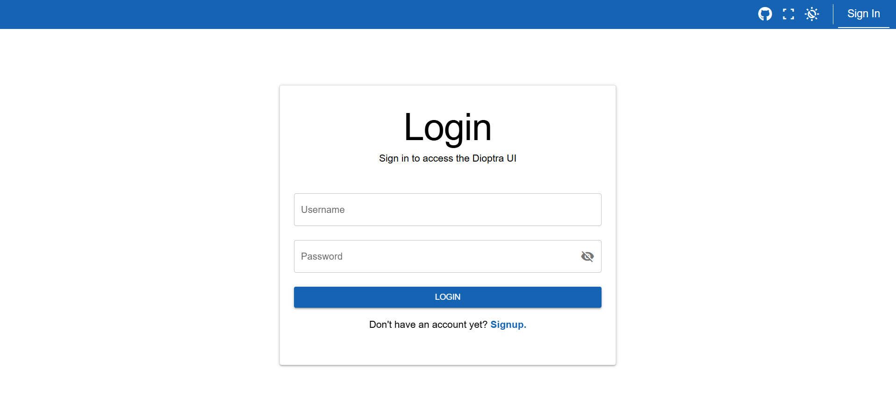

Setup
=====================

Before running your first plugin task, we need to prepare the environment.

Start the Dioptra Services
--------------------------

.. note:: 
   If you have not already built the Dioptra Docker containers, you need to do that first.
   See :doc:`../../../getting-started/building-the-containers`

Make sure the Dioptra Docker containers are running:

.. code-block:: bash

   docker compose up

You should now be able to access the Dioptra web UI in your browser (default: http://127.0.0.1).

Login or Sign Up
----------------

Open the web UI and either **log in** with an existing account or **sign up** for a new one.

Groups
------

Navigate to the **Groups** tab.  
You should see only the default **Public** group — this is where we will run our first experiments.

.. figure:: _static/screenshots/groups_dioptra.png
   :alt: Screenshot of the Groups tab showing the Public group.
   :width: 900px

Queues
------

Navigate to the **Queues** tab and create a new queue:

- **Name:** `tensorflow_cpu`  
- **Visibility:** Public  

We call it `tensorflow_cpu` because this tutorial assumes only CPU resources are available.  
By making it **public**, all users in the Public group can submit jobs to it.

.. figure:: _static/screenshots/queues_dioptra.png
   :alt: Screenshot of the queue creation form with "tensorflow_cpu" entered as the name.
   :width: 900px

.. note::
   **Learn more about Groups and Queues**

   - :doc:`Groups Documentation <../guides/groups>`  
   - :doc:`Queues Documentation <../guides/queues>`

Next Steps
----------

Now that Dioptra is set up, let's begin: :doc:`part-1`