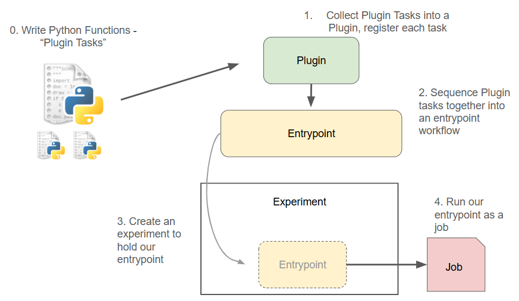
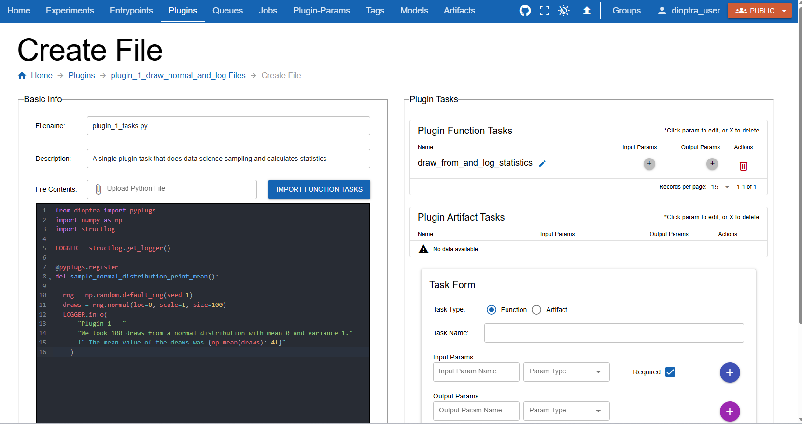
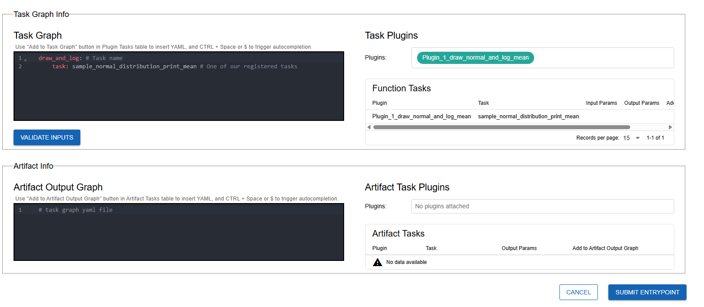
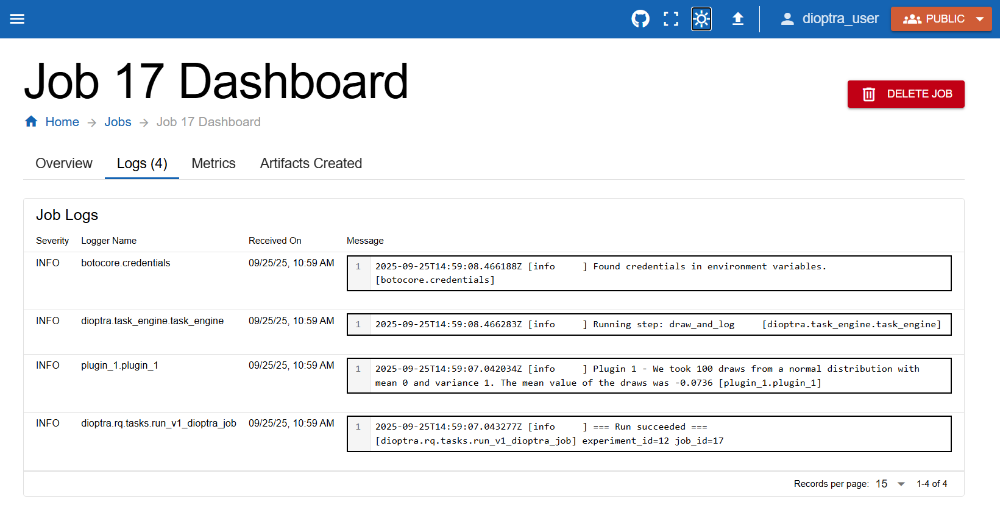

.. This Software (Dioptra) is being made available as a public service by the
.. National Institute of Standards and Technology (NIST), an Agency of the United
.. States Department of Commerce. This software was developed in part by employees of
.. NIST and in part by NIST contractors. Copyright in portions of this software that
.. were developed by NIST contractors has been licensed or assigned to NIST. Pursuant
.. to Title 17 United States Code Section 105, works of NIST employees are not
.. subject to copyright protection in the United States. However, NIST may hold
.. international copyright in software created by its employees and domestic
.. copyright (or licensing rights) in portions of software that were assigned or
.. licensed to NIST. To the extent that NIST holds copyright in this software, it is
.. being made available under the Creative Commons Attribution 4.0 International
.. license (CC BY 4.0). The disclaimers of the CC BY 4.0 license apply to all parts
.. of the software developed or licensed by NIST.
..
.. ACCESS THE FULL CC BY 4.0 LICENSE HERE:
.. https://creativecommons.org/licenses/by/4.0/legalcode
:html_theme.sidebar_secondary.remove:

.. _tutorial-1-part-1:

Running your first plugin task
==============================

Overview
--------

Our goal is to run some Python code in Dioptra.  
The essential steps are:

1. Write Python code to define Plugin Tasks  
2. Create a Plugin to register those tasks  
3. Create an Entrypoint workflow that sequences specific tasks  
4. Run the Entrypoint as a Job within an Experiment  

   **Dioptra Workflow Overview**  
   The four essential steps needed to run Python functions in Dioptra.

The power of Dioptra is that it lets users reuse tasks and workflows across experiments.  
For this first tutorial, we’ll keep it simple: a single Plugin Task inside one Entrypoint.

.. _tutorial-1-part-1-make-your-first-plugin:

Make Your First Plugin
----------------------

We will create a plugin with one task. This task will:

- Simulate data from a normal distribution  
- Print the mean of our samples using logging  

We can refer to the Dioptra logs to see if our Plugin task worked. 

Create the Plugin in the UI
~~~~~~~~~~~~~~~~~~~

.. note::
   Plugins, tasks, entrypoints, and types can be created through the User Interface (UI), Rest API, or TOML files.  
   In this tutorial, we’ll use the UI.

.. admonition:: Steps

   1. Navigate to the **Plugins** tab.  
   2. Click **Create Plugin**.  
   3. Enter a name and description 
   
      - e.g. "plugin_1", "My first plugin to sample from a normal distribution"
   
   4. Click submit.

Add a Python File
~~~~~~~~~~~~~~~~~~~

We now attach code to the Plugin.

.. admonition:: Steps (continued)

   1. In the plugin list, click the **file icon** for the plugin you just created.  
   2. Click **Create** to add a new Python file.  
   3. In the **Basic Info** tab, provide a filename (e.g., `plugin_1.py`).  
   4. Paste the following code into the editor:

**Plugin 1** 

.. admonition:: Plugin 1
    :class: code-panel python

    .. literalinclude:: ../../../../examples/tutorials/tutorial_1/plugin_1.py
       :language: python

   Adding a Python file during Plugin creation

.. note::
   The ``@pyplugs.register`` decorator registers this Python function as a **Plugin Task**.

.. _tutorial-1-part-1-make-your-first-plugin:

Register the Plugin Task
~~~~~~~~~~~~~~~~~~~

Functions must be registered as tasks before they can be used in Entrypoints.

.. admonition:: Steps (finalizing)

   1. In the task form window, register the function with the name ``sample_normal_distribution_print_mean``.  

      - Note: Plugin task names _must_ match the Python function name 

   2. Leave input/output parameters blank.
   3. Click Save File

Create an Entrypoint
--------------------

Entrypoints define workflows made of tasks. Ours will be a single-task workflow.

.. admonition:: Steps

   1. Go to the **Entrypoints** tab.  
   2. Click **Create Entrypoint**.  
   3. Fill in the name and description.  
   
      - e.g. "Entrypoint 1", "A simple entrypoint to run our first plugin task"
   
   4. In the **Task Graph Info** window, do the following:
   
      1. Select the Plugin we made in :ref:`tutorial-1-part-1-make-your-first-plugin` in the **Task Plugins** window

      2. In the **Task Graph Info** tab, paste the YAML below into the Task Graph YAML editor.

**Entrypoint 1 Task Graph**

.. admonition:: Task Graph
    :class: code-panel yaml

    .. literalinclude:: ../../../../examples/tutorials/tutorial_1/entrypoint_1_task_graph.yaml
       :language: yaml

   Defining the Entrypoint task graph in the UI

Note that we used the name of our registered task, ``sample_normal_distribution_print_mean``, as defined in :ref:`tutorial-1-part-1-make-your-first-plugin`

.. admonition:: Steps (finalizing)

   5. Click **Validate Inputs** to check the type alignment for the Task Graph 
   
      - Note: For this entrypoint, it should always pass — our plugin task has no parameters

   6. Click **Submit Entrypoint**.

Make an Experiment
------------------

Experiments hold entrypoints.

.. admonition:: Steps

   1. Navigate to the **Experiments** tab.  
   2. Click **Create Experiment** - fill in a name and description.  
   3. In the Entrypoint dropdown, select the Entrypoint you just created.  
   4. Click **Submit Experiment**.

Run a Job
---------

Jobs execute entrypoints within experiments.

.. admonition:: Steps

   1. Open the Experiment you just created.  
   2. Click **Create Job**.  
   3. Select the Entrypoint, add a name and description.  
   4. Click **Submit Job**.

.. figure:: _static/screenshots/create_job.png
   :alt: Screenshot of creating a job from the experiment page.
   :width: 900px
   :figclass: big-image border-image clickable-image

   Submitting a job from the Experiment page

The job will first appear as **Queued**, then change to **Finished** after a short time.

.. figure:: _static/screenshots/job_1_finished.png
   :alt: Screenshot showing a finished job in Dioptra.
   :width: 900px
   :figclass: big-image border-image clickable-image

   Job status changes from Queued to Finished

Inspect Logs
~~~~~~~~~~~~~~~~~~~

In the **Jobs** tab, click the job we just ran. Navigate to the logs tab. 

   The logs generated by our first job. 

Notice that the logger name ``plugin_1.plugin_1`` generated the following message:

.. admonition:: Job 1 Log Outputs
   :class: code-panel console

   .. code-block:: console

      Plugin 1 - We took 100 draws from a normal distribution with mean 0 and variance 1. The mean value of the draws was -0.0736 

This behavior matches what we would expect from our simple Plugin Task. It worked!

Conclusion
----------

You have now run your first Plugin Task in Dioptra.  
Next, we’ll add **inputs and outputs** to our Plugin Task so you can parametrize your Entrypoints.
