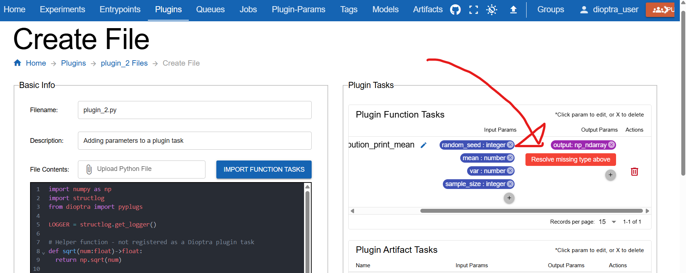
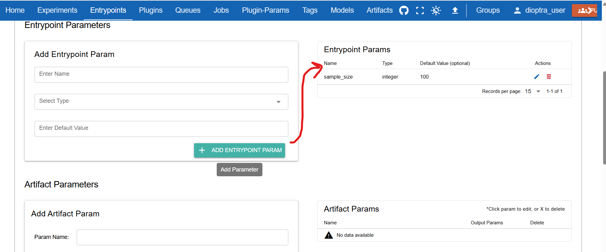
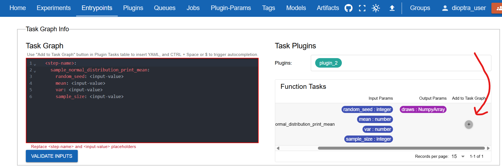

Adding Inputs and Outputs
=========================

Overview
--------

In the previous tutorial, you created a plugin with one task and ran it through an Entrypoint and Experiment.  
Now, you will extend that example to include **parameters and outputs**.  

This will let you:

- Define **input parameters** for a Plugin Task  
- Create a custom **output type** (NumPy array)  
- Parameterize Entrypoints and Jobs to get different results  

The goal is to run our Entrypoint twice with different **sample sizes** and see how the observed mean compares to the true distribution mean.  

Create a New Type
-----------------

Before a task can output a NumPy array, we need to define the type in Dioptra.

.. admonition:: Steps

   1. Navigate to the **Plugin-Params** tab.  
   2. Click **Create**.  
   3. Enter the name: ``NumpyArray``.  
   4. Save.

.. figure:: _static/screenshots/make_numpy_array_type.png
   :alt: Screenshot of creating a new type called NumpyArray.
   :width: 900px
   :figclass: bordered-image

   Creating a new type in the UI

Make Plugin 2
-------------

We will now create a new plugin with one task. This task:

- Accepts four parameters: ``random_seed``, ``sample_size``, ``mean``, and ``var``  
- Samples a NumPy array from a normal distribution  
- Returns the array as an output  

.. admonition:: Steps

   1. Go to the **Plugins** tab → **Create Plugin**.  
   2. Name it ``plugin_2`` and add a short description.  
   3. Add a new Python file ``plugin_2.py`` and paste in the following code:

**Plugin 2 Code**

.. literalinclude:: ../../../../examples/tutorials/tutorial_1/plugin_2.py
   :language: python
   :linenos:

Register the Task
~~~~~~~~~~~~~~~~~~~

Unlike last time, we must specify input and output types.

.. admonition:: Steps

   1. Click **Import Function Tasks** to auto-detect functions from ``plugin_2.py``.  

.. figure:: _static/screenshots/import_plugin_tasks.png
   :alt: Screenshot of the "Import Function Tasks" button.
   :width: 900px
   :figclass: bordered-image

You may see an error under **Plugin Tasks**: *Resolve missing Type* for the ``np_ndarray`` output.

This is because we created a type called ``NumpyArray``.  

Delete the incorrect output, then add a new one:  

- Name: ``draws`` (more descriptive)  
- Type: ``NumpyArray``  

Save the file.

Create Entrypoint 2
-------------------

Entrypoint setup is very similar to before, but this time we’ll add an **Entrypoint parameter**.

.. admonition:: Steps

   1. Create a new Entrypoint (``entrypoint_2``).  
   2. In the **Entrypoint Parameters** window, create a parameter:  
      - Name: ``sample_size``  
      - Type: ``int``  
      - Default value: e.g., ``100``  

.. literalinclude:: ../../../../examples/tutorials/tutorial_2/entrypoint_2_task_graph.yaml
   :language: yaml
   :linenos:

.. note::
   Default parameters can be overridden when running a Job.

Create the Entrypoint Task Graph 
~~~~~~~~~~~~~~~~~~~

Next, add the plugin task to the graph:

- Go to **Task Graph Info**.  
- Select **plugin_2** from the Plugins list.  
- Click **Add to Task Graph**.  

By default, the step has no name and no parameter bindings. We must configure inputs:

- ``mean`` = ``10``  
- ``var`` = ``10``  
- ``random_seed`` = ``0``  
- ``sample_size`` = ``$sample_size`` (a reference to the Entrypoint parameter)  

.. figure:: _static/screenshots/entrypoint_2_edit_task_graph.png
   :alt: Screenshot of editing parameters in Entrypoint 2 task graph.
   :width: 900px
   :figclass: bordered-image

Add Entrypoint 2 to Experiment 1
--------------------------------

We don’t need a new Experiment. We can add Entrypoint 2 to the one we already made.

.. admonition:: Steps

   1. Open **Experiment 1**.  
   2. Add **Entrypoint 2** to the experiment.  

.. figure:: _static/screenshots/add_entrypoint_2_to_experiment_1.png
   :alt: Screenshot of adding Entrypoint 2 to an existing experiment.
   :width: 900px
   :figclass: bordered-image

Run Two Jobs
------------

Now we’ll test different parameter values.

.. admonition:: Steps

   1. Click on the **Jobs** tab and create a new job
   2. Select experiment 1 and entrypoint 2
   3. Set ``sample_size`` to a large value (e.g., 10,000).  
   4. Submit the Job.  

.. figure:: _static/screenshots/entrypoint_2_job_10000.png
   :alt: Screenshot of running Entrypoint 2 with sample_size=10000.
   :width: 900px
   :figclass: bordered-image

Repeat the process:

- Create another Job with ``sample_size`` = 100.  

.. figure:: _static/screenshots/entrypoint_2_showing_all_jobs.png
   :alt: Screenshot showing multiple jobs created with different sample sizes.
   :width: 900px
   :figclass: bordered-image

Wait for both jobs to finish.

Inspect Results
---------------

When jobs complete, check:

- Logs confirm the parameter values used  
- The returned ``NumpyArray`` outputs differ in how close their sample mean is to the true mean  

.. note::
   This experiment shows a basic illustration of the Law of Large Numbers: 
   as the sample size increases, the sample mean tends to get closer to the population mean.

Conclusion
----------

You now know how to:

- Define custom types  
- Register Plugin Tasks with inputs and outputs  
- Run Entrypoints and Jobs with parameters  

Next, we’ll chain multiple tasks together into a single workflow.
