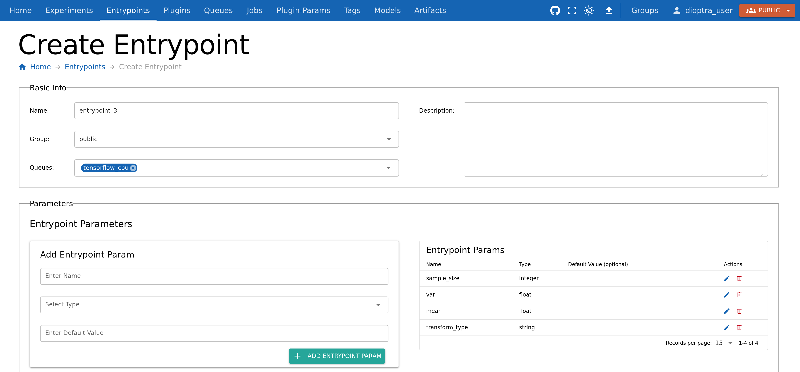
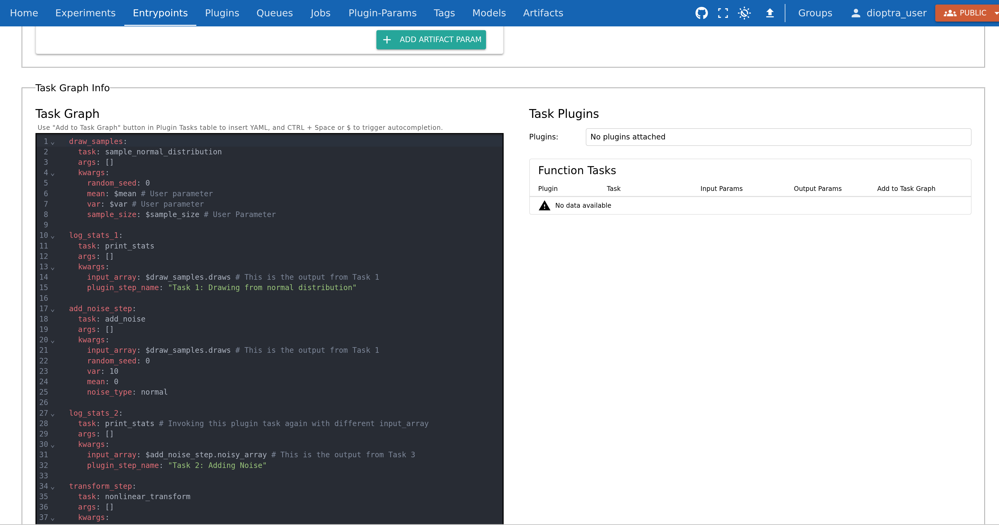

Building a Multi-Step Workflow
==============================

Overview
--------

So far, you have built plugins with a single task and connected them to an Entrypoint.  
Now, you will extend the idea further by creating a **multi-task plugin** and chaining those tasks together in an Entrypoint.  

This will let you:

- Register multiple Python functions as tasks in one Plugin  
- Reference outputs of earlier tasks as inputs for later tasks  
- Repeat tasks with different inputs  
- See how multiple steps could be chained together to make a data generation workflow

We will run the workflow once and inspect how the data evolves across multiple steps.  

Make Plugin 3
-------------

Plugin 3 will include multiple functions, each registered as a Plugin Task.  
Other than containing more functions, creating the plugin is the same as before.

The tasks include:

- **sample_normal_distribution**: sample a NumPy array  
- **add_noise**: perturb the array with additive noise sampled from a normal distribution
- **nonlinear_transform**: apply a configurable transformation (e.g., square each value)  
- **print_stats**: log mean, variance, min, max  

.. admonition:: Steps

   1. Go to the **Plugins** tab → **Create Plugin**.  
   2. Name it ``plugin_3`` and add a short description.  
   3. Paste the code below 
   4. Import functions via **Import Function Tasks** (as in Part 2).  

**Plugin 3 Code**

.. literalinclude:: ../../../../examples/tutorials/tutorial_1/plugin_3.py
   :language: python
   :linenos:

Create Entrypoint 3
-------------------

Entrypoint 3 will demonstrate a **multi-step task graph**.  
We will pass arrays from one task to the next and re-use the ``print_stats`` task multiple times.

Parameters for this Entrypoint:

- ``sample_size`` (int)  
- ``mean`` (float)  
- ``var`` (float)  
- ``transform_type`` (str, e.g. ``square``)  

.. admonition:: Steps

   1. Create a new Entrypoint (``entrypoint_3``).  
   2. Add Entrypoint Parameters: ``sample_size``, ``mean``, ``var``, and ``transform_type``. Choose the appropriate type for each (``int``, ``number``, ``number``, ``string``) 

Build the Task Graph
~~~~~~~~~~~~~~~~~~~~

The graph now has **six steps**:

1. ``draw_normal`` (generates draws)  
2. ``print_stats`` (on draws)  
3. ``add_noise`` (adds noise to draws)  
4. ``print_stats`` (on noisy draws)  
5. ``transform`` (applies chosen transform)  
6. ``print_stats`` (on transformed output)  

Key ideas:

- Reference outputs of earlier tasks (e.g., use ``draws`` from step 1 in step 2).  
- Re-use the same task (``print_stats``) multiple times with different inputs.  

.. admonition:: Steps (continued)

   1. Go to **Task Graph Info** and copy the following YAML code:

**Entrypoint 3 Task Graph YAML** 

.. literalinclude:: ../../../../examples/tutorials/tutorial_1/entrypoint_3_task_graph.yaml
   :language: yaml
   :linenos:

.. Note:: 

    Notice how the ``$`` syntax is used to reference both parameter names AND the output of plugin tasks.

Create Experiment 2
-------------------

Because this workflow is conceptually different, let’s make a new experiment.

.. admonition:: Steps

   1. Create a new Experiment (``experiment_2``).  
   2. Add **Entrypoint 3** to the experiment.  

Run a Job
---------

Let’s try it out.

.. admonition:: Steps

   1. Go to the **Jobs** tab → Create Job.  
   2. Select **experiment_2** and **entrypoint_3**.  
   3. Choose some parameter values - for example:  
      - ``sample_size`` = 1000  
      - ``mean`` = -5  
      - ``var`` = 10
      - ``transform_type`` = ``square``  
   4. Submit the Job.  

.. figure:: _static/screenshots/entrypoint_3_create_job.png
   :alt: Screenshot of a multi-step task graph for Entrypoint 3.
   :width: 900px
   :figclass: bordered-image

Inspect Results
---------------

After the job finishes, check the logs to see the statistics evolve:

- After ``add_noise``: min/max shift noticeably, variance increases, mean remains stable.  
- After ``transform (square)``: all values change, mean and variance increase dramatically, min shifts upward.  

This illustrates how small modifications (noise, transforms) could propagate through a data pipeline.  

Conclusion
----------

You now know how to:

- Register multiple tasks in a single plugin  
- Build a multi-step Entrypoint task graph  
- Reference outputs and repeat tasks  
- Run experiments with complex workflows  

Next, we will save outputs as **artifacts**, so results can be inspected beyond logs.
