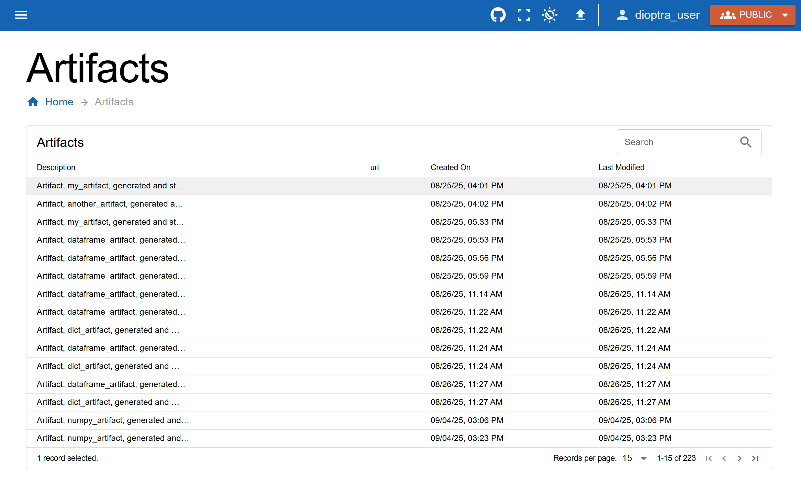

:html_theme.sidebar_secondary.remove:

Saving Artifacts
==========================

Overview
--------

In the last section, you created a multi-step workflow and watched how data evolved across chained tasks.  
Now, you will learn how to **save outputs as artifacts**.  

We will build on **Experiment 2**, **Plugin 3**, and **Entrypoint 3**, adding artifact-saving logic.  

Create an Artifact Plugin
-------------------------

Before Dioptra can save objects to disk, it needs to know how to serialize and deserialize them.  
This is handled by an **artifact plugin**.  

Just like before, we will create a new plugin, but this time define **artifact tasks**.

.. admonition:: Steps

   1. Go to the **Plugins** tab → **Create Plugin**.  
   2. Name it ``artifact_plugin`` and add a short description.  
   3. Copy and paste the code below.  

**Artifact Plugin Code**

.. admonition:: Artifact Plugin 
    :class: code-panel python

    .. literalinclude:: ../../../../examples/tutorials/tutorial_1/numpy_artifact_plugin.py
       :language: python
       :linenos:

.. note::

   This plugin defines an artifact task: ``NumpyArrayArtifactTask``

   To define an artifact task, you must overwrite two methods:
   
   - **serialize**: convert an in-memory object (e.g., NumPy array) into a file  
   - **deserialize**: read the file back into an object  

.. figure:: _static/screenshots/artifact_task_plugin.png
   :alt: Screenshot of a job producing an artifact.
   :width: 100%
   :figclass: big-image border-image clickable-image

   Defining an Artifact Task Plugin requires creating a subclass of ``ArtifactTaskInterface``. The validation method is undefined here but can validate the arguments for the serialize and deserialize function. 

.. admonition:: Steps (finalized)

   1. In the **Task Form** window, select **Artifact** and enter the name ``NumpyArrayArtifactTask`` 
   2. Leave the output params blank - our Artifact Task is basic and requires no special arguments 

Once registered, Dioptra will know how to store and retrieve this object type.  

Modify Entrypoint 3
-------------------

Next, we will modify **Entrypoint 3** to include an artifact-saving task.  
Nothing about **Plugin 3** itself needs to change.

.. admonition:: Steps

   1. Open **Entrypoint 3**.  
   2. In the **Artifact Info** window, add our new Artifact Plugin
   3. Add the task to the graph 
   4. Rename the step to something like ``save_numpy_artifact``
   5. Set contents equal to the output from step 4, e.g. ``$transform_step``

.. figure:: _static/screenshots/artifact_task_graph.png
   :alt: Screenshot of a job producing an artifact.
   :width: 100%
   :figclass: big-image border-image clickable-image

   The Artifact Output Graph defines the logic for which Plugin Tasks should be saved and how. 

.. note::

   When the artifact task runs, it automatically calls the ``serialize`` method and writes a file to the artifact store.  

.. warning::
    Currently the UI does not actually support editing entrypoints in this way - we need to investigate and fix this. For now, you could make a new entrypoint instead.

Update the Experiment
---------------------

Because this changes the workflow, let’s re-run Experiment 2 with the updated Entrypoint.  

**Question**: Would the experiment automatically update with a new entrypoint? 

.. admonition:: Steps

   1. Click refresh on the experiment? TBD

Run a New Job
-------------

Now let’s try it out.

.. admonition:: Steps

   1. Create a new job using the entrypoint we just defined / edited (use whatever parameters you'd like)

Inspect the Artifact
--------------------

After the job finishes:

- Go to the **Artifacts** tab.  
- You should see a new artifact file created by the workflow.  
- Download it to confirm it was saved successfully (?)

   A work in progress display of the created artifacts - needs to be updated. 

Congratulations—you’ve just saved your first artifact!  

Conclusion
----------

You now know how to:

- Create an artifact plugin with **serialize** and **deserialize** methods  
- Add artifact tasks into an Entrypoint  
- Save task outputs as reusable files  
- Verify artifact creation through the Dioptra UI  

In the next part, we will **load artifacts into new Entrypoints**, so results from one workflow can feed directly into another.
