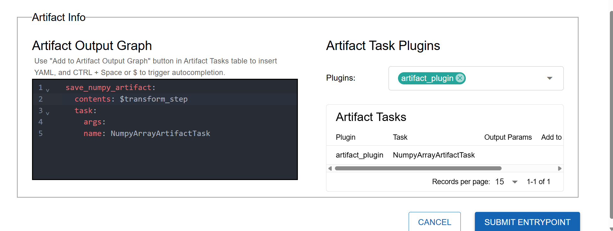

.. This Software (Dioptra) is being made available as a public service by the
.. National Institute of Standards and Technology (NIST), an Agency of the United
.. States Department of Commerce. This software was developed in part by employees of
.. NIST and in part by NIST contractors. Copyright in portions of this software that
.. were developed by NIST contractors has been licensed or assigned to NIST. Pursuant
.. to Title 17 United States Code Section 105, works of NIST employees are not
.. subject to copyright protection in the United States. However, NIST may hold
.. international copyright in software created by its employees and domestic
.. copyright (or licensing rights) in portions of software that were assigned or
.. licensed to NIST. To the extent that NIST holds copyright in this software, it is
.. being made available under the Creative Commons Attribution 4.0 International
.. license (CC BY 4.0). The disclaimers of the CC BY 4.0 license apply to all parts
.. of the software developed or licensed by NIST.
..
.. ACCESS THE FULL CC BY 4.0 LICENSE HERE:
.. https://creativecommons.org/licenses/by/4.0/legalcode
:html_theme.sidebar_secondary.remove:

.. _tutorial-1-part-4:

Saving Artifacts
==========================

Overview
--------

In the last two sections, you created a multi-step workflow and watched how data evolved across chained tasks.  
Now, you will learn how to **save task outputs as artifacts**.  

We will build on **Experiment 3**, **Plugin 3**, and **Entrypoint 3**, adding artifact-saving logic.  

.. _tutorial-1-part-4-create-artifact-plugin:

Create an Artifact Plugin
-------------------------

Before Dioptra can save objects to disk, it needs to know how to serialize and deserialize them.  
This is handled by an **artifact plugin**.  

Just like before, we will create a new plugin, but this time we'll define **artifact tasks**.

.. admonition:: Steps

   1. Go to the **Plugins** tab → **Create Plugin**.  
   2. Name it ``artifact_plugin`` and add a short description.  
   3. Create a python file in the plugin and name it
   4. Copy and paste the code below.  

**Artifact Plugin Code**

.. admonition:: Artifact Plugin 
    :class: code-panel python

    .. literalinclude:: ../../../../examples/tutorials/tutorial_1/numpy_artifact_plugin.py
       :language: python
       

.. note::

   This plugin defines an artifact task: ``NumpyArrayArtifactTask``

   To define an artifact task, you must overwrite two methods:
   
   - **serialize**: convert an in-memory object (e.g., NumPy array) into a file  
   - **deserialize**: read the file back into an object  

   You may optionally define **validate** to validate the argument types for these methods. 

   The serialize method should return the path to where the object is saved to disk. More information 
   is available in <ADD REFERENCE>

.. _tutorial-1-part-4-register-artifact-task:

.. figure:: _static/screenshots/artifact_task_plugin.png
   :alt: Screenshot of a job producing an artifact.
   :width: 100%
   :figclass: big-image border-image clickable-image

   Defining an Artifact Task Plugin requires creating a subclass of ``ArtifactTaskInterface``.

.. admonition:: Steps (finalized)

   1. In the **Task Form** window, select **Artifact** and enter the name ``NumpyArrayArtifactTask`` 
   2. For the output parameter of the task, add the **name** ``output`` and the **type** ``NumpyArray``

.. note::

   Whereas a Plugin task gets its name from the Python function name, an Artifact plugin task gets its name from the subclass name 
   (in this case, NumpyArrayArtifactTask). The output parameter type tells Dioptra what kind of object we can expect to be made
   available after the ``deserialize`` method is ran - in this case, a Numpy Array. 

Once registered, Dioptra will know how to store and retrieve this object type. We invoke the logic through the use of **Artifact Tasks** in Entrypoints.

Modify Entrypoint 3 to save artifacts
-------------------

Next, we will modify **Entrypoint 3** to include an artifact-saving task.  
Nothing about **Plugin 3** itself needs to change.

.. admonition:: Steps

   1. Open **Entrypoint 3**.  
   2. In the **Artifact Info** window, add our new Artifact Plugin
   3. Add the task to the graph 
   4. Rename the step to something like ``save_numpy_artifact``
   5. Set contents equal to the output from step 4, e.g. ``$transform_step``

   The Artifact Output Graph defines the logic for which Plugin Tasks should be saved and how. ``contents`` should be a reference to a step name from the task graph. 

.. note::

   When the artifact task runs, it automatically calls the ``serialize`` method and writes a file to the artifact store.  

.. warning::
   BUG - Currently the UI does not support editing entrypoints in this way - we need to investigate and fix this. For now, you could make a new entrypoint instead.

Run a job of entrypoint 3 with artifact saving
-------------

Now let’s try it out.

.. admonition:: Steps

   1. Create a new job using the entrypoint we just defined / edited (use whatever parameters you'd like)

.. note::

   When an artifact task graph is defined, the logic will execute once all the plugin tasks have completed.  

Inspect the Artifact
--------------------

After the job finishes, click on the job to see the results:

- Go to the **Artifacts** tab.  
- You should see a new artifact file created by the workflow.  
- Download it to confirm it was saved successfully

.. figure:: _static/screenshots/download_artifact.png
   :alt: Screenshot of a job producing an artifact.
   :width: 100%
   :figclass: big-image border-image clickable-image

   Download the artifact from the Job Dashboard.

A ``.npy`` should have been downloaded. This is the numpy array after the the random noise was added and the transform was applied. 

Congratulations — you’ve just saved your first artifact!  

Conclusion
----------

You now know how to:

- Create an artifact plugin with **serialize** and **deserialize** methods  
- Add artifact tasks into an Entrypoint  
- Save task outputs as reusable files  
- Verify artifact creation through the Dioptra UI  

In the next part, we will **load artifacts into new Entrypoints**, so results from one workflow can feed directly into another.
