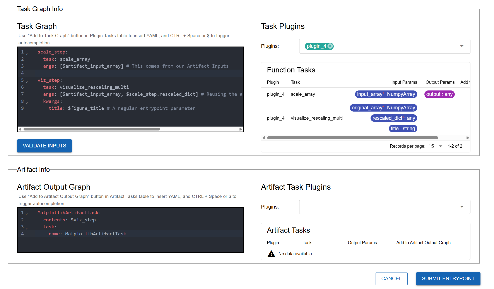
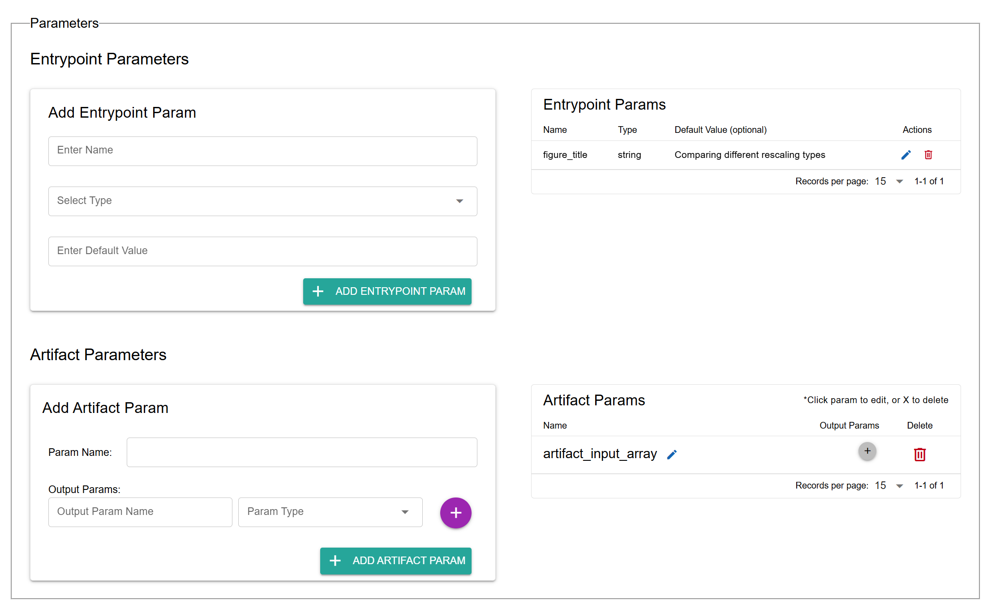
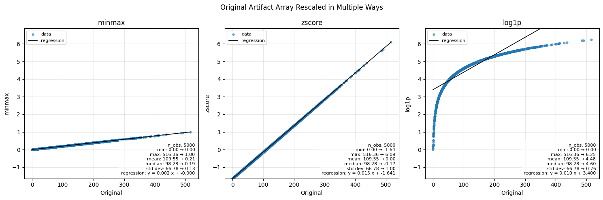

.. This Software (Dioptra) is being made available as a public service by the
.. National Institute of Standards and Technology (NIST), an Agency of the United
.. States Department of Commerce. This software was developed in part by employees of
.. NIST and in part by NIST contractors. Copyright in portions of this software that
.. were developed by NIST contractors has been licensed or assigned to NIST. Pursuant
.. to Title 17 United States Code Section 105, works of NIST employees are not
.. subject to copyright protection in the United States. However, NIST may hold
.. international copyright in software created by its employees and domestic
.. copyright (or licensing rights) in portions of software that were assigned or
.. licensed to NIST. To the extent that NIST holds copyright in this software, it is
.. being made available under the Creative Commons Attribution 4.0 International
.. license (CC BY 4.0). The disclaimers of the CC BY 4.0 license apply to all parts
.. of the software developed or licensed by NIST.
..
.. ACCESS THE FULL CC BY 4.0 LICENSE HERE:
.. https://creativecommons.org/licenses/by/4.0/legalcode
:html_theme.sidebar_secondary.remove:

.. _tutorial_1_part_5:

Using Saved Artifacts
=====================

Overview
--------

In the last section, you learned how to save task outputs as artifacts.  
Now, we will take the next step: **using a saved artifact as input in a new workflow**.  

This is done through **artifact parameters**. They behave like Entrypoint parameters, but instead of being set at job creation, they are **loaded from disk**. You can then reference them throughout the task graph.  

In this example, we will build a new workflow that:

- **Loads** a saved NumPy array **artifact** from Entrypoint 4  
- Applies **multiple rescaling methods  **
- **Visualizes** the results with Matplotlib  
- **Saves** the resulting **figure as a new artifact**

Create a Rescaling Plugin
----------------------------------

First, we need a new plugin containing new Plugin Tasks for a brand new Entrypoint workflow.  
This Entrypoint will use our saved Numpy artifact as an input. The plugin creation process is the same process as done in :ref:`tutorial-1-part-3-make-plugin-3`.

.. admonition:: Steps

   1. Go to the **Plugins** tab → **Create Plugin**.  
   2. Name it ``rescaling_plugin`` and add a short description.  
   3. Copy and paste the code below.  
   4. Import the functions via **Import Function Tasks**. Fix any Types as needed.

**Rescaling Plugin Code**

.. admonition:: Plugin 4
    :class: code-panel python

    .. literalinclude:: ../../../../examples/tutorials/tutorial_1/plugin_4.py
       :language: python
       

This plugin defines two new tasks - ``scale_array`` to rescale the array three different ways and ``visualize_rescaling_multi`` to visualize all the rescaled arrays. 

Add Matplotlib Figure Artifact
---------------------------------------

Next, let’s update the artifact plugin so that we can save a Matplotlib figure (the output of our second task).

.. admonition:: Steps

   1. Open your ``artifact_plugin`` from Part 4 :ref:`tutorial-1-part-4-create-artifact-plugin`.  
   2. Add the new imports and the new Artifact Plugin code below to define ``MatplotlibArtifactTask``.  
   3. Register it in our Plugin the same way as the ``NumpyArrayArtifactTask`` in :ref:`tutorial-1-part-4-register-artifact-task`.  

**Matplotlib Artifact Code**

Add this code to your existing Python file with the NumpyArray Artifact Task. 

.. admonition:: New Imports (copy to top of file)
   :class: code-panel python

    .. literalinclude:: ../../../../examples/tutorials/tutorial_1/matplotlib_fig_artifact_plugin.py
       :language: python
       :start-after: # [new-imports]
       :end-before: # [end-new-imports]

.. admonition:: Artifact Plugin (add below your Numpy Array Artifact Task)
    :class: code-panel python
        
    .. literalinclude:: ../../../../examples/tutorials/tutorial_1/matplotlib_fig_artifact_plugin.py
       :language: python
       :start-after: # [Plugin-definition]
       

Create Entrypoint 5
-------------------------

Now let’s define a new Entrypoint that uses an artifact as input.  

.. admonition:: Steps

   1. Go to the **Entrypoints** tab → **Create Entrypoint**.  
   2. Name it ``entrypoint_5``.  
   3. Select the relevant Plugins in the ``Task Plugins`` and ``Artifact Task Plugins`` windows
   3. Copy the following code blocks into the Task Graph and Artifact Output Graph boxes

**Entrypoint 5 Task Graph and Artifact Output Task Graph** 

.. admonition:: Task Graph
    :class: code-panel yaml

    .. literalinclude:: ../../../../examples/tutorials/tutorial_1/entrypoint_5_task_graph.yaml
       :language: yaml
       

.. admonition:: Artifact Output Task Graph
    :class: code-panel yaml

    .. literalinclude:: ../../../../examples/tutorials/tutorial_1/entrypoint_5_artifact_output_task_graph.yaml
       :language: yaml
       

**Copy the code into the appropriate boxes**

.. note::
    Note that in the task graph, we are referencing ``$artifact_input_array``. This is referencing a loaded artifact. We will need to define this under the ``Artifact Parameters`` window. 

**Add Artifact and Entrypoint Parameters**

.. admonition:: Steps (finalized)

   1. Add an **artifact parameter** that points to the saved NumPy array artifact from Part 4. Call the Artifact Parameter ``artifact_input_array``
   2. Add standard parameters if desired (e.g., figure title for the visualization plugin task).  

   This task graph uses positional arguments instead of keyword arguments. Our artifact output graph saves the generated matplotlib figure from step 2. 

Click validate inputs to ensure all the types are aligned. Submit your entrypoint. 

Create Experiment and Job
----------------------------------

Finally, let’s test it out.

.. admonition:: Steps

   1. Create a new Experiment (``experiment_5``).  
   2. Add **Entrypoint 5**.  
   3. Create a new Job.  
   4. When configuring the job, select the artifact snapshot created in Part 4.  

.. figure:: _static/screenshots/job_select_artifact.png
   :alt: Screenshot of job configuration showing artifact snapshot selection.
   :width: 100%
   :figclass: big-image border-image clickable-image

Inspect Results
---------------

After running the job, open the logs and artifact view. Comparing the original array to rescaling methods, we see:

The original NumPy array from Entrypoint 4 ranged from 0–516.  
Here’s how the three scaling methods reshape it:

- **Min–Max Scaling**: Linearly maps values into [0,1], preserving relative spacing.  
- **Z-Score Scaling**: Centers data at 0 with unit variance; shows distance from the mean.  
- **Log1p Scaling**: Nonlinear compression; reduces the impact of large values and outliers.  

The saved Matplotlib figure should display these transformations side-by-side.  

**Artifact Output from Entrypoint 5**

   The artifact that was generated from this entrypoint - a matplotlib figure showing the various rescaling methods. 

Conclusion
----------

You now know how to:

- Define new plugins for additional data transformations  
- Extend the artifact plugin to handle new object types (e.g., Matplotlib figures)  
- Create Entrypoints that use **artifact parameters** as inputs  
- Chain workflows together across Experiments using artifacts  

**Tutorial complete!** 
You’re now ready to design your own workflows in Dioptra, combining multiple plugins, artifacts, and experiments.
